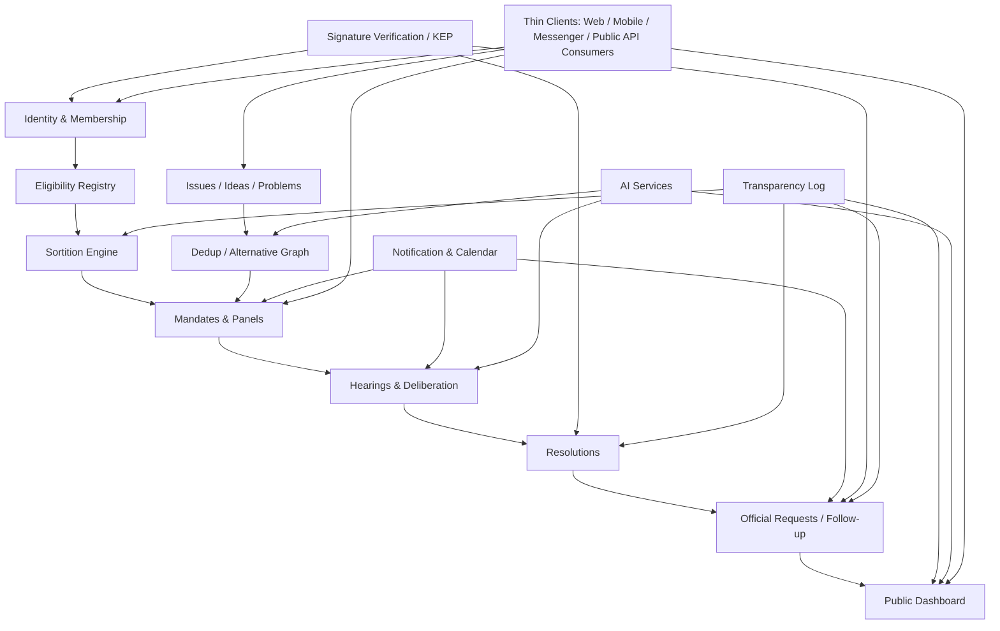

# Архитектура системы «Віче»

## Executive summary

«Віче» имеет смысл проектировать не как «ещё одно приложение для опросов» и не как Telegram-бот с политическим уклоном, а как **headless civic platform**: ядро с сильной доменной моделью, журналами доверия, API-контрактами и тонкими клиентами поверх него. Для вашей цели — массовая ГО, которую трудно игнорировать, — это важнее красивого первичного интерфейса: доверие, воспроизводимость процедур, юридическая аккуратность и возможность строить независимые клиенты важнее единственного «суперприложения». Правовую оболочку под такую систему в украинском контексте даёт urlзакон о громадських об’єднанняхturn0search4, а требования к электронной идентификации и доверительным услугам — urlзакон об электронной идентификации и электронных доверительных услугахturn0search5. citeturn0search0turn0search4turn0search1turn0search5

С инженерной точки зрения оптимальная стартовая форма для «Віче» — **модульный монолит с жёсткими внутренними границами + event bus + отдельный публичный transparency log**, а не микросервисы «с первого дня». Это позволяет намного быстрее собрать MVP, сохранить единый транзакционный контур для мандатов, сортировки, подписей, резолюций и correspondence tracking, и при этом не потерять API-first дисциплину за счёт urlOpenAPIturn10search18, urlAsyncAPIturn10search1 и urlJSON Schematurn10search2 как обязательных контрактов системы. citeturn10search0turn10search1turn10search2turn10search6

Архитектурно систему лучше разделить на три самостоятельных контура: **массовый сигнальный контур** (идеи, жалобы, настроения, комментарии, проблемы), **делиберативный контур** (жеребьёвка, панели, дебаты, резолюции) и **контур официального follow-up** (запросы служащим, отчёты, сроки, ответы, просрочки, публичные дашборды). Это соответствует эмпирике deliberative democracy: сырая массовая обратная связь полезна как sensor layer, но deliberative legitimacy возникает только там, где есть чёткая цель, репрезентативная выборка, качественная информация, время на обсуждение и публичный follow-through. Именно такие требования фиксирует entity["organization","OECD","intergovernmental organisation"] в своих good practice principles и evaluation guidelines. citeturn6search0turn6search1turn6search2turn6search7

Для идентификации и подписи в Украине нет практического смысла выпускать собственную «карточку Віче» на старте. Гораздо реалистичнее и дешевле опереться на уже существующую экосистему: entity["organization","НБУ","Ukraine central bank"] для удалённой идентификации через urlBankID НБУturn0search2, urlДія.Підписturn4search2 и общий urlдоверительный список квалифицированных поставщиковturn4search11 для КЕП. Модель «своей смарт-карты» по образцу entity["country","Эстония","country in Europe"] технологически понятна, но институционально и операционно тяжела: там цифровые документы выпускаются государством, карта несёт сертификаты аутентификации и подписи и живёт внутри национальной PKI. Для ГО это на старте избыточно. citeturn0search2turn0search6turn4search2turn4search11turn3search3turn3search12

Ключевая программная идея отчёта такова: «Віче» следует строить как **систему протоколов и журналов**, а не как «один сайт». Канонический язык домена должен быть украинским, а многоязычность — отдельным переводным слоем; юридически и репутационно значимые действия должны проходить через сильную идентификацию и подпись; публично проверяемые части — через append-only журналы с Merkle-proof; AI — только как ассистент для дедупликации, модерации, суммаризации и поиска, но никогда как источник окончательной воли, мандата или tally. Для доверительных и прозрачных журналов сильные ориентиры дают entity["organization","NIST","us standards institute"] randomness beacon reference, urlRFC 9162 по Certificate Transparencyturn1search0, urlTrillianturn9search5 и urlRekorturn9search1. citeturn1search0turn1search1turn1search2turn9search1turn9search5

## Проектные ограничения и архитектурные принципы

Для «Віче» правильнее исходить из того, что это **гражданская инфраструктура влияния**, а не параллельное государство. Это значит, что доменная модель, интерфейсы и moderation policy должны изначально исключать политическое участие в выборах, промоцию кандидатов, персональные «расследования», doxxing и любые режимы, которые толкают систему из civic oversight в campaign tech. Юридически ГО в Украине — непредпринимательское объединение, которое может действовать со статусом юрлица или без него; отдельно действует законодательство о персональных данных и об электронной идентификации. Поэтому система должна проектироваться вокруг lawful civic workflows, а не around loopholes. citeturn0search0turn0search4turn0search5turn8search0turn8search1

Из этого следуют четыре архитектурных принципа. Первый — **API-first before UX-first**: сначала контракты, события, состояния и права доступа, потом богатые клиенты. Второй — **canonical Ukrainian domain**: все сущности, статусы, типы сигналов, резолюции и workflow-идентификаторы хранятся в украинском каноническом виде; переводы живут в localization-layer и версионируются отдельно. Третий — **mass participation with graduated trust**: читать и наблюдать могут многие, подавать сигналы — verified members, попадать в eligible pool для мандатов — только strongly verified members. Четвёртый — **public verifiability without public exposure**: публика должна видеть, что процедуры корректны, но не обязана видеть юридические личности всех участников. Такая логика хорошо согласуется и с deliberative design principles, и с украинскими требованиями к персональным данным. citeturn6search0turn6search1turn8search0turn8search1

С точки зрения продукта это означает, что ядро «Віче» не должно быть person-centric. Центральными объектами системы должны быть не «люди, о которых собирают досье», а **институты, должности, сервисные единицы, территории, проблемы, предложения, панели и резолюции**. Например, не «Иванов плохой чиновник», а «позиция X в ведомстве Y не ответила на запрос в срок Z» или «участковое отделение №N не предоставило отчёт по сервисному стандарту». Это не только снижает юридический риск, но и программно удерживает систему от скатывания в crowd-powered harassment platform. citeturn0search4turn8search0

Поскольку цель — массивность, число мандатов действительно логично привязывать не к абстрактному населению, а к **активным верифицированным членам ГО**. Для программной системы это означает наличие отдельной policy-функции, например:  
`seats(level, territory, period) = clamp(min, ceil(active_verified_members / ratio), max)`  
где `active_verified_members` — это не общее число зарегистрированных аккаунтов, а число участников, прошедших сильную идентификацию и подтвердивших участие в жизни ГО в заданном окне времени. Именно такой подход уменьшает ценность накрутки «мертвых душ» и делает массовость организационно, а не только маркетингово значимой. Сильную идентификацию в украинской среде реалистично строить через существующие механизмы удалённой идентификации и КЕП. citeturn0search2turn0search6turn0search5turn4search2

## Референсная программная архитектура

Для первого приближения «Віче» лучше всего моделировать как **модульный монолит с выделенным trust-layer**, а не как сеть автономных сервисов. Причина проста: домены сортировки, мандатов, подписей, correspondence tracking и резолюций настолько тесно связаны семантически и юридически, что на старте выигрывают от единого транзакционного контура. При этом API-first дисциплина сохраняется через обязательные machine-readable контракты для HTTP API, асинхронных событий и JSON-структур. Такой подход прямо поддерживается официальными спецификациями urlOpenAPIturn10search18, urlAsyncAPIturn10search1 и urlJSON Schematurn10search2. citeturn10search0turn10search1turn10search2turn10search6

Практически архитектура должна делиться на три технических уровня. **Tier 0** — контур доверия: identity, membership eligibility, signature verification, lottery, transparency log, critical audit. **Tier 1** — контур гражданских процессов: issues, proposals, alternative groups, panels, hearings, resolutions, official requests and responses. **Tier 2** — контур взаимодействия и масштаба: comments, sentiment, clustering, search, streaming, AI summaries, notifications, public portal. Такое разделение важно потому, что Tier 2 можно временно деградировать или даже отключать без потери доверия к мандатам и резолюциям, а Tier 0 — нельзя. Эта логика хорошо сочетается с OECD emphasis на design integrity, evaluation и traceability. citeturn6search1turn6search2

Ниже — рекомендуемая референсная схема ядра:

Эта схема отражает главный архитектурный выбор: **не один “центр управления интерфейсом”, а одно доменное ядро и много thin clients**. Пользовательский интерфейс здесь вторичен по отношению к протоколу. Такой подход особенно хорошо подходит к вашему тезису, что «остальные интерфейсы — просто другие программы, которые пользуются UX сервера»: на практике это означает server-driven UI и action manifests, а не толстую бизнес-логику в каждом клиенте. Под это очень хорошо ложатся JSON Schema для форм и OpenAPI/AsyncAPI для действий и событий. citeturn10search0turn10search1turn10search2

Рекомендуемая доменная декомпозиция выглядит так:

| Модуль | Канонические сущности | Что хранит как source of truth |
|---|---|---|
| Identity & Membership | member, legal_identity_ref, membership, consent, locale | статусы членства, уровни доверия, согласия |
| Eligibility & Territory | territory, residency_claim, eligibility_snapshot | допуск к жеребьёвке и территориальная привязка |
| Sortition & Mandates | draw, seed_bundle, panel, mandate, reserve | жеребьёвка, мандаты, резервы, cooldown |
| Issues & Proposals | issue, proposal, alternative_group, duplicate_edge | проблемы, идеи, альтернативы и связи |
| Deliberation | hearing, agenda, evidence_pack, expert_slot, transcript | заседания, повестка, материалы, протоколы |
| Resolution & Follow-up | resolution, request, response, deadline, escalation | официальные запросы, ответы, сроки, эскалации |
| Notifications & Calendar | event, reminder, delivery_attempt, calendar_item | напоминания, подтверждения, дедлайны |
| Trust & Audit | signature_record, log_entry, proof_bundle, incident | доказательства, логи, проверки, инциденты |
| Search & AI | embedding_ref, summary, moderation_hint, cluster | производные AI-артефакты, не source-of-truth |

Это именно **bounded contexts**, а не обязательные отдельные сервисы. На первом этапе их разумно держать в одном репозитории и одном deployable, но с независимыми схемами, внутренними интерфейсами и outbox-событиями. Это позволяет потом без боли вынимать тяжёлые зоны — media, search, AI, notifications — в отдельные сервисы. citeturn10search0turn10search1

Для хранения данных разумен следующий тройной контур. Во‑первых, **реляционная operational DB** для текущих состояний и транзакций. Во‑вторых, **объектное хранилище** для документов, видео, доказательств, записей, презентаций и ответов. В‑третьих, **append-only transparency log** для внешне проверяемых контрольных следов: публикации snapshots eligible pool, seeds жеребьёвки, checkpoints, hashes резолюций, доказательства отправки и получения официальной корреспонденции, итоговые tally artifacts. Для публично проверяемого лога в качестве концептуальной базы подходят urlRFC 9162turn1search0, urlTrillianturn9search5 и urlRekorturn9search1. citeturn1search0turn9search0turn9search1turn9search5

## Доверие, идентификация и криптографический контур

Идентификацию в «Віче» следует строить не по одному каналу, а по **лестнице доверия**. Для входа и базовой верификации членства подходит удалённая идентификация через urlBankID НБУturn0search2; для юридически значимых действий — подтверждение мандата, подписание резолюции, отправка официального запроса — нужен КЕП, включая urlДія.Підписturn4search2 или другой квалифицированный носитель из urlдоверительного списка КНЕДПturn4search11; для повседневной session hardening и антифишинга поверх этого очень полезен entity["organization","W3C","web standards consortium"]-стандарт urlWebAuthnturn11search2. Такая комбинация даёт хорошее разделение: strong legal identity — для критических операций, passkeys/WebAuthn — для безопасного повседневного доступа. citeturn0search2turn0search6turn4search2turn4search11turn11search1turn11search2turn11search15

Собственную ID-карту «Віче» на ранней стадии я считаю стратегически ошибочной идеей. У государства в entity["country","Эстония","country in Europe"] ID-карта является частью всей национальной инфраструктуры: документы выпускаются государством, карта несёт сертификаты, используются PIN-коды для аутентификации и подписи, а весь lifecycle включает выпуск, перевыпуск, revoke, compatibility software и helpdesk. В Украине уже существует широкий and legally recognized контур доверительных услуг, включая удалённое получение КЕП на токен и мобильную подпись. Для ГО на ранней и даже средней стадии дешевле и надёжнее интегрировать существующих провайдеров, чем строить собственную PKI. citeturn3search3turn3search12turn4search2turn4search13turn4search11

Для жеребьёвки нужен не просто RNG, а **воспроизводимая публичная лотерея**. Правильный контур выглядит так: публикуется хэш frozen eligible-pool, затем после freeze date собирается bundle случайности из двух независимых beacon-источников, например NIST beacon и drand, затем запускается воспроизводимый selection algorithm, а результаты публикуются вместе с seed bundle, commit hash алгоритма и proof bundle на включение/исключение. И у NIST reference for randomness beacons, и у drand ключевой смысл именно в публичной верифицируемости и снижении риска смещения/обвинений в смещении. citeturn1search1turn1search5turn1search2turn1search6turn1search9

Для advisory-голосований внутри панелей лучше использовать **E2E-verifiable модель**, а не непрозрачный server-side tally. Хороший ориентир — urlElectionGuardturn1search7: verification codes, challenged ballots, publication of encrypted artifacts and zero-knowledge proofs. Исторически полезен и urlHeliosturn5search2 как open-audit web voting, но с важной оговоркой: общая литература по internet voting остаётся очень осторожной, особенно для государственных выборов. Поэтому в «Віче» криптографически проверяемые интернет-голосования разумно применять для **внутренних консультативных решений и утверждения резолюций**, а не для попыток заменить официальные выборы. citeturn1search3turn1search7turn1search15turn1search19turn5search1turn5search2

Приватность и лёгкая защита участников должны быть встроены прямо в модель идентичности. Я рекомендую минимум четыре идентификатора: `legal_identity_id`, `member_id`, `public_member_id`, `mandate_alias`. При этом юридическая личность хранится в отдельном sealed registry, отделённом от публичных сущностей; публичные панели могут показывать псевдонимы или обезличенные профили; раскрытие личности panel member должно быть опциональным или управляться отдельной политикой. Такой split design одновременно поддерживает массовость, уменьшает давление на участника и помогает соблюдать закон о персональных данных. citeturn8search0turn8search1turn0search5

Следующая важная вещь — **тройной журнал доверия**. Внутри operational DB есть business events; отдельно — внутренний неизменяемый internal audit log; отдельно — внешний публичный transparency log с redacted payload и криптографическими proofs. В публичный лог не надо писать весь текст обращений и все персональные данные; туда должны попадать контрольные хэши, checkpoints, tree heads, proofs и минимально необходимые метаданные. Именно так работают современные transparency systems: public verifiability достигается не публикацией всех секретов, а tamper-evident структурой журнала. citeturn1search0turn9search1turn9search3turn9search5

## API, данные и программная модель

Поскольку вы хотите «сначала примитивный UX, а упор на обширный API», я бы разделил интерфейсы не по каналам, а по типу контракта. Нужны четыре API-класса: **Domain API** для канонических действий и сущностей; **UX API** для server-driven экранов, форм и action-manifests; **Event API** для асинхронных событий; **Public Read API** для прозрачности, статистики, дашбордов и внешних клиентов. Для описания этого стека логично использовать OpenAPI для HTTP, AsyncAPI для событий и JSON Schema как общий типовой язык форм, payloads и screen descriptors. citeturn10search0turn10search1turn10search2turn10search7

Это даёт очень важный архитектурный эффект: web, mobile, messenger-clients, operator console и публичные дашборды становятся просто разными рендерами одной и той же системы, а не отдельными логиками. Тогда «другие программы, которые пользуются UX сервера» перестают быть метафорой и становятся реальным паттерном: клиент получает JSON Schema формы, policy hints, доступные действия, validation rules, localized labels и рендерит экран. В MVP это особенно ценно: можно быстро менять поведение и workflow без переписывания пяти интерфейсов. citeturn10search2turn10search17

Базовые доменные ресурсы я бы зафиксировал так:

| API-контур | Основные ресурсы |
|---|---|
| Membership API | members, memberships, consents, locales, trust-levels |
| Territory API | territories, residency-claims, local chapters |
| Sortition API | eligible-pools, seed-bundles, draws, reserves, mandates |
| Issue API | issues, proposals, duplicates, alternatives, tags |
| Deliberation API | panels, hearings, agendas, transcripts, evidence-packs |
| Resolution API | draft-resolutions, adopted-resolutions, minority-reports |
| Follow-up API | requests, deadlines, responses, escalations, compliance-states |
| Notification API | subscriptions, reminders, delivery-attempts, calendars |
| Transparency API | checkpoints, proofs, signed-tree-heads, audit artifacts |
| Public Analytics API | trends, heatmaps, service-quality signals, follow-up metrics |

С точки зрения данных главная тонкость — **не смешивать raw public signal с deliberative output**. Лайки, жалобы, комментарии и «настроения» не должны жить в той же семантической плоскости, что и резолюции панели. Поэтому у объекта `issue` должен быть минимум три слоя: `signal_layer`, `deliberation_layer`, `official_followup_layer`. Первый показывает массу; второй — обдуманную позицию случайно выбранной панели; третий — реакцию института. Именно так «неорганизованная толпа» превращается в продуктивную гражданскую систему, а не в очередную шумовую ленту. Этот разрыв между input и considered judgement — центральная мысль deliberative literature. citeturn6search0turn6search1turn6search14

Для дублей и альтернатив программно нужен не список постов, а **граф идей**. У каждого нового сигнала или предложения должны вычисляться: similarity cluster, duplicate candidates, alternative candidates и parent issue. На уровне API это означает отдельные типы связей: `duplicate_of`, `alternative_to`, `amends`, `depends_on`, `narrows`, `broadens`. Тогда система может не только сливать копии, но и хранить несовместимые варианты решения одной проблемы. AI здесь полезен для кластеризации и дедупликации, но финальное решение о merge/alternative должно оставаться за человеком-модератором или standing council. citeturn6search0turn6search2

AI-контур для «Віче» должен быть **bounded and reversible**. Он может делать семантический поиск, clustering, summary, draft moderation labels, extraction of action items, transcript indexing, multilingual assist и briefings. Но он не должен подтверждать членство, валидировать юридическую подпись, проводить жеребьёвку, быть source of truth для tally или заменять человеку-модератору решение о правовом риске. Все AI-артефакты должны иметь provenance: модель, время генерации, входные источники, confidence, human review state. Это особенно важно в системе, которая претендует на доверие, а не на «магический ИИ». Подход соответствует и OECD emphasis на balanced information, и общему принципу verifiability-by-design. citeturn6search0turn6search2turn1search0

Для официальной корреспонденции нужен отдельный state machine. Я бы проектировал его так: `draft → signed → sent → delivery_confirmed → acknowledged → answered → published → closed` плюс ветки `overdue`, `rejected`, `needs_escalation`. Подпись должна проверяться по доверительному списку КНЕДП; подтверждение доставки зависит от канала: API-receipt — высокий уровень уверенности, подписанное уведомление — средний, screenshot/manual upload — низкий. Это важно потому, что у разных государственных и муниципальных структур уровень цифровой интеграции сильно различается. «Віче» должно уметь жить с неоднородностью каналов, не ломая доменную модель. citeturn4search11turn4search8turn4search12

Процессный поток можно моделировать так:

```mermaid
flowchart LR
    A[Подача сигнала или предложения] --> B[Дедупликация и граф альтернатив]
    B --> C[Классификация по уровню: район / громада / город / регион / национальный]
    C --> D[Порог массового сигнала или решение standing council]
    D --> E[Формирование eligible pool]
    E --> F[Жеребьёвка и мандаты]
    F --> G[Подтверждение участия / COI disclosure / календарь]
    G --> H[Дебаты, evidence pack, expert hearings]
    H --> I[Черновик резолюции]
    I --> J[Проверка фактов и подписи]
    J --> K[Публикация резолюции и proofs]
    K --> L[Официальный запрос / отчёт / follow-up]
    L --> M[Публичный дашборд исполнения]
```

## Медиа, уведомления и примитивный UX

Поскольку Telegram в вашей концепции не должен быть ядром, я рекомендую рассматривать все мессенджеры и внешние площадки как **edge adapters**, а не как home platform. Авторитетное состояние должно жить в web-native и API-native ядре; каналы вроде entity["company","Telegram","messaging company"], электронной почты, SMS или федеративного чата должны доставлять события, deep-links и подтверждения, но не быть единственным носителем identity и source of truth. Это особенно верно для Mini Apps: официальная документация прямо требует валидировать `initData` на сервере и не доверять `initDataUnsafe`. citeturn12search0turn12search1turn12search2

Из этого следует MVP-структура интерфейсов. Достаточно трёх обязательных клиентов. Первый — **public portal**: читать отчёты, смотреть дашборды, резолюции, сроки, просрочки, transparency proofs, расписание слушаний, публичные стримы. Второй — **member cabinet**: вступление, верификация, согласия, настройки языка, идеи, участие в обсуждениях, календарь, уведомления, COI-декларации, подтверждение мандата, документы и подписи. Третий — **operator / secretariat console**: модерация, дедупликация, подготовка evidence packs, запуск жеребьёвки, публикация протоколов, correspondence tracking, инциденты. Всё остальное — боты, виджеты, mobile app, embedded clients — может прийти позже как thin clients к тем же API. citeturn10search0turn10search1turn10search2turn12search0

Для видеоконференций и стриминга у вас по сути три инженерных направления. Быстрый self-hosted старт дают urlJitsi Meetturn2search0 и urlBigBlueButtonturn2search1. Если же приоритет — программируемость, низкая задержка, granular control и native RTMP-egress на публичные платформы, сильнее выглядит urlLiveKitturn2search2. Для отдельного слоя сообщества и федеративных комнат можно рассматривать urlMatrix / Synapseturn2search3, но не как основной контур deliberation-room. citeturn2search0turn2search1turn2search2turn2search3turn2search12turn2search18

Сравнение по архитектурной роли выглядит так:

| Вариант | Сильная сторона | Слабая сторона | Роль в «Віче» |
|---|---|---|---|
| Jitsi | быстрый self-hosting, простая интеграция | меньше управляемости для сложных процедур | хороший MVP для малых и средних заседаний |
| BigBlueButton | сильные роли, classroom-like управление, записи | более тяжёлый operational footprint | хорош для structured hearings и обучающих сессий panel members |
| LiveKit | API-first реального времени, ingress/egress, RTMP на публичные площадки | требует более зрелой инженерной команды | лучший media-core для долгосрочной headless-платформы |
| Matrix | федеративные комнаты и community layer | не заменяет deliberation workflow и официальные протоколы | дополнительный community/chat слой, не ядро |

Это сравнение основано на официальных документациях self-hosting, federation и media transport/egress перечисленных систем. citeturn2search0turn2search1turn2search2turn2search3turn2search14turn2search20

Поэтому практическая рекомендация такая: если вы хотите как можно быстрее запустить пилот — берите Jitsi или BigBlueButton как временный media backend, но **проектируйте вокруг абстрактного media adapter interface**. Если цель — сразу строить API-first ядро, которое переживёт рост и множество клиентов, то media core должен быть отделённым модулем, а не логикой «внутри фронтенда». Для открытых трансляций лучше держать раздельные роли: закрытая рабочая комната, public watch stream, archive pipeline и transcript pipeline. Официальная документация LiveKit прямо поддерживает экспорт и livestreaming via RTMP на публичные платформы, а self-hosted Jitsi/BBB решают задачу закрытых комнат. citeturn2search0turn2search1turn2search2turn2search14turn2search22

Уведомления должны быть многоканальными и иерархическими. Для неважных событий достаточно in-app и email. Для приглашения в eligible pool, подтверждения мандата, смены времени hearing, дедлайна подписания и просрочки ответа нужны **fan-out notifications**: in-app + email + messenger adapter + optional SMS fallback. Критические события должны требовать positive acknowledgement, иначе система должна запускать escalation policy и переходить к резервному участнику. Так как Telegram не является ядром, его роль здесь — быстрый канал доставки, а не носитель правового значения. citeturn12search0turn12search2

## Дорожная карта, расходы и открытые вопросы

Я бы запускал «Віче» в четыре инженерных фазы. **Фаза 1** — протокол и модульный монолит: membership, issues, dedup graph, mandates, notifications, public portal, простейший transparency log, web cabinet, operator console. **Фаза 2** — legal-grade trust additions: BankID onboarding, КЕП/Дія.Підпис, proof bundles, публичные checkpoints, correspondence state machine. **Фаза 3** — media и AI: self-hosted hearings, transcripts, summaries, multi-language layer, public dashboard execution tracking. **Фаза 4** — ecosystem mode: открытые external client SDK, расширенный Public API, независимые verifier tools, зеркала transparency log, региональные операционные узлы. Такая последовательность минимизирует риск построить дорогую оболочку без доверительного ядра. citeturn10search0turn10search1turn1search0turn9search1turn9search5

С точки зрения расходов главная ошибка — считать, что такой проект «дорогой из-за серверов». На практике самый дорогой слой — **человеческий контур качества**: модерация, фасилитация, подготовка evidence packs, проверка юридических рисков, incident response, оценка качества делиберации. AI действительно даст постоянные расходы, но их надо держать вне критического пути: отдельный inference broker, бюджетные лимиты, асинхронные очереди, provider abstraction, кэширование, human approval для официальных материалов. Тогда AI не превращается в обязательную дорогую зависимость для каждого действия пользователя. OECD evaluation logic и общий опыт institutionalised deliberation показывают, что доверие создаёт не «умная нейросеть», а качество процесса и объяснимый follow-up. citeturn6search1turn6search2

Для команды первого полноценного пилота realistic minimum — небольшое ядро из product/architect, backend engineer, frontend engineer, devops/security engineer, analyst/moderation lead и part-time legal/compliance support. Но уже на стадии local pilot стоит выделять отдельную роль владельца протокола доверия: кто отвечает за eligible snapshots, random beacons, proofs, log checkpoints и reproducibility playbook. В системах типа «Віче» архитектурная уязвимость часто возникает не в красивом UI, а в том, что никто персонально не держит trust pipeline end-to-end. Эта рекомендация вытекает из самой природы публично проверяемых логов и verifiable procedures. citeturn1search0turn1search1turn1search2turn9search1turn9search5

Метрики успеха для «Віче» должны измерять не только рост пользовательской базы, но и институциональную полезность. Минимальный набор выглядит так: доля verified members от общего membership, acceptance rate на мандат, no-show rate, median time to hearing, median time to signed resolution, median time to official response, percent overdue requests, доля резолюций с formal answer, public reproducibility rate for draws, transparency-log monitor health, harassment incident rate, а также доверие пользователей к fairness процедуры. Такая оценка полностью соответствует логике evaluation guidelines для representative deliberative processes. citeturn6search2turn6search4

Есть и принципиальные открытые вопросы. Первый — **единый доступ к надёжной территориальной и членской привязке** без избыточного сбора персональных данных. Второй — **вариативность цифровых каналов у самих институтов**, которым «Віче» будет писать: не везде есть одинаковые API и одинаковая прослеживаемость доставки. Третий — **граница между анонимностью и публичной подотчётностью мандата**: для общественного доверия не всегда достаточно видеть только псевдонимы, но избыточная публичность опасна для рядовых участников. Четвёртый — **федерация**: со временем сеть ГО почти наверняка захочет распределённую модель, но начинать с fully federated write-path я не рекомендую — лучше сначала central protocol + public mirrors + external verifiers, а не многосерверная консистентность с первого дня. Эти ограничения не делают проект слабым; они просто означают, что архитектура «Віче» должна расти как protocolised civic infrastructure, а не как очередное социальное приложение. citeturn8search0turn0search5turn1search0turn9search1turn9search7

Финальный вывод отчёта таков: для вашей цели — собрать очень большую, продуктивно организованную ГО, которую трудно игнорировать, — лучшим программным образом является **API-ориентированная, украинскоязычная по домену, многоязычная по представлению, публично проверяемая по процедурам и псевдонимная по мандатам civic operating system**. Не Telegram-центричный продукт, а ядро процедур, журналов, резолюций и follow-up; не «разоблачительная платформа», а система институционализированного гражданского запроса и рекомендации; не «блокчейн ради блокчейна», а доказуемый trust layer там, где он действительно нужен. Именно такая архитектура больше всего соответствует и вашей политической интуиции, и доступным сегодня правовым и техническим опорам в Украине. citeturn0search4turn0search5turn0search2turn4search2turn1search0turn6search1