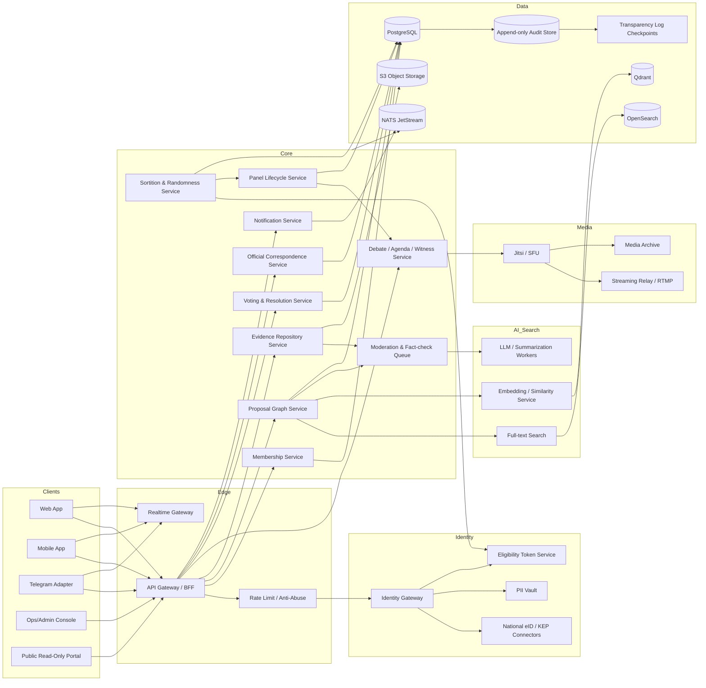

# Viche Open Technical Architecture Specification

## Executive Summary

**Viche** should be designed as an API-first civic deliberation platform for a non-electoral NGO overlay: a lawful system that organizes very large numbers of participants into rotating, multi-level deliberative panels, captures public proposals and evidence, routes official correspondence, and publishes auditable recommendations without becoming a political party, campaign tool, or shadow state. For the Ukrainian context, the lawful center of gravity is not “running elections,” but supporting association, petitions, correspondence, deliberation, and public accountability workflows that fit within the right to individual and collective appeals and the legal space for public associations. The platform’s default authoritative language should be Ukrainian, with a versioned multilingual layer for accessibility and internationalization. citeturn24search11turn24search0turn23search13turn23search1turn3search21

The strongest architecture is **not** “put everything on a blockchain.” The better default is a conventional, open-source, verifiable architecture: a transactional system of record, immutable audit trails, periodic Merkle checkpoints, public transparency logs, verifiable randomness, and cryptographic signatures. That gives Viche strong auditability, better privacy, lower operational cost, and easier legal compliance than a public-chain-first design, while still allowing optional external randomness beacons or notarization points where public verifiability matters. citeturn16search6turn16search7turn16search1turn9search0turn8search6

The recommended platform shape is: **web/mobile/Telegram adapters at the edge; identity and membership gateway; sortition and panel lifecycle engine; proposals/evidence/graph service; conferencing and streaming service; notifications and correspondence service; analytics/search layer; append-only audit and transparency service; and a data plane built around PostgreSQL, OpenSearch, Qdrant, NATS JetStream, and S3-compatible object storage**. For video deliberation, self-hosted Jitsi fits well; for public reach, conferences should be relayed outward to public streaming endpoints rather than forcing Viche to become a global CDN. citeturn32search0turn32search1turn32search2turn12search17turn12search2turn33search2turn12search15turn34search3turn34search17turn34search16

Identity should be **layered, not monolithic**. Viche should support: browser-native passkeys for baseline account security; stronger national e-identification where available; Ukrainian qualified electronic signatures and Diia/BankID integrations for high-assurance actions; Estonian eID paths for international readiness; and optional pseudonymous or anonymity-preserving participation modes where the workflow does not require public identification. The platform should separate **eligibility proof** from **public identity disclosure**. citeturn1search23turn18search4turn5search0turn5search3turn6search2turn6search0turn4search1turn4search11turn36search15turn36search19turn36search2

The essential institutional insight is that Viche should combine **mass participation** with **small, rotating deliberative bodies**. Large-scale crowds are good at surfacing problems, evidence, and agenda salience; randomly selected, time-bound panels are better at hearing witnesses, examining alternatives, and drafting coherent recommendations. That pattern is consistent with the evidence base on representative deliberative processes collected by the entity["organization","OECD","policy organization"]. citeturn17search6turn17search9turn17search17turn17search4

## Scope, Assumptions, and Design Principles

Viche is assumed to be an NGO-operated civic platform rooted in entity["country","Ukraine","eastern europe"], but intentionally international-ready. It does not elect officeholders, fund or endorse candidates, or conduct opposition research. It does organize submission of public problems, structured deliberation, recommendations, evidence bundles, and official correspondence to public bodies and officials. In the Ukrainian legal frame, that aligns naturally with the constitutional right to petition and the statutory framework for citizen appeals and public associations; if EU residents, infrastructure, or cross-border data processing are involved, entity["organization","European Union","supranational union"] GDPR obligations also become relevant. citeturn24search11turn24search0turn23search13turn3search21turn3search19

The platform should adopt the following design principles:

First, **authoritative process data should be separate from public discourse data**. A signed resolution, an official outgoing letter, a panelist mandate, and an audit event are not the same kind of object as a comment, emoji reaction, or AI-generated summary. This separation simplifies access control, privacy, retention, and legal defensibility. That separation also maps well onto relational storage plus append-only audit records. citeturn32search0turn32search2turn32search1turn16search6

Second, **identity should be progressive**. Many civic actions should require only a low-friction account and good bot resistance; higher-trust actions such as serving on a panel, signing a formal resolution, or dispatching official correspondence should step up to stronger identification or signature methods. Browser passkeys and WebAuthn provide a strong phishing-resistant baseline, while national eID and qualified signatures provide stronger proofing where needed. citeturn1search23turn18search4turn5search0turn6search2turn4search1

Third, **Viche should be multilingual by architecture, but Ukrainian by authority**. Authoritative originals for official recommendations, signed resolutions, and outbound correspondence should be stored in Ukrainian, with separately versioned translations that may be marked informative, machine-assisted, human-verified, or officially certified. This aligns with state-language realities while remaining accessible to minority-language and international participants. From an implementation perspective, W3C internationalization guidance, CLDR locale data, and a modern localization system such as Fluent are the right foundations. citeturn23search1turn19search0turn19search2turn19search3

Fourth, **the system should prefer verifiable public administration patterns over social-media patterns**. The closest civic-tech relatives are platforms such as urlDecidimturn35search9 and urlCONSUL DEMOCRACYturn35search2 for participation workflows, urlHelios Votingturn35search7 for verifiability ideas, and urlOpenSlidesturn27search0 or urlJitsiturn34search12 for meeting operations. Viche should borrow modular patterns from such systems, but add stronger sortition, official-correspondence, anonymity-mode, and transparency-log primitives than most existing civic participation stacks provide out of the box. citeturn35search9turn35search13turn35search2turn35search18turn35search7turn35search11turn27search0turn34search12turn34search3

## Reference Architecture

The recommended architecture is **service-oriented by trust boundary and scale boundary**, but not “microservices everywhere from day one.” A sensible path is a **modular monolith** for core civic workflow in the first release, with separate services for identity, media, search, embeddings, and audit/transparency; then split further only when load, secrecy needs, or independent operational cadence justify it. citeturn13search4turn14search3turn11search14turn12search15



A good default open-source stack for those blocks is: **FastAPI or Django** for API services; **Keycloak** for federated IAM and OIDC/SAML brokering; **PostgreSQL** for the transactional source of truth; **OpenSearch** for full-text, filters, and public analytics views; **Qdrant** or **pgvector** for semantic retrieval and duplicate detection; **NATS Core + JetStream** for events, notifications, and fan-out; **Jitsi Meet + Jibri** for conferences and streaming; and **Kubernetes + Helm + Argo CD** for repeatable deployment. These technologies all have active official documentation and fit the operational requirements of open, self-hosted civic infrastructure. citeturn11search4turn11search1turn14search1turn33search3turn33search15turn32search0turn32search1turn12search17turn12search2turn15search2turn33search2turn12search15turn34search3turn34search17turn13search4turn14search2turn14search3

Viche should expose **REST for commands, GraphQL or denormalized read endpoints for composite reads, event streams for realtime UI, and webhooks for external integrations**. That split keeps the mutating surface more auditable while letting rich clients query exactly the read models they need. The event bus should be treated as an integration plane, not as the canonical ledger; the canonical ledger remains the transactional database plus append-only audit chain. citeturn18search3turn33search2turn16search6

## Identity, Sortition, Deliberation, and Data Contracts

### Identity and e-signature options

The right operating model is **one membership profile, multiple assurance methods, multiple disclosure modes**. A participant can have one durable internal member ID, but different actions can require different proofs: passkey login, national eID assertion, qualified signature, or an unlinkable eligibility token. That makes Viche both usable and legally adaptable. citeturn1search23turn18search4turn5search0turn6search2turn36search19

| Option | Best role in Viche | Strengths | Limits | Recommended use |
|---|---|---|---|---|
| urlWebAuthn / passkeysturn1search23 | Baseline login, account recovery hardening | Phishing-resistant, browser-native, origin-bound authentication. citeturn1search23turn18search4 | Not a civil-identity proof by itself. | Default login for all accounts. |
| urlDiia.Signatureturn5search0 | High-assurance login and signing in Ukraine | Official integration path for signing and authorization in websites/apps. citeturn5search0turn5search3 | Integration access and operational terms depend on the provider/government program. | Panel acceptance, formal resolutions, official submissions. |
| urlBankID NBUturn6search2 | Remote identity proofing in Ukraine | Secure encrypted transfer of user data, initiated only by the user. citeturn6search2turn6search0 | Primarily identity assertion, not itself a document-signing mechanism. | Membership verification and duplicate prevention. |
| Qualified electronic signature under Ukrainian law | Strong signature and legal formality | Ukrainian law defines qualified electronic signatures and trust-service framework. citeturn4search1turn4search11turn5search18 | Higher operational friction; certificate lifecycle management required. | Signing outgoing correspondence and authoritative acts. |
| Estonian eID / Mobile-ID / Smart-ID | International-ready high-assurance path | Official Estonian stack supports authentication and digital signing equivalents. citeturn36search19turn36search2turn36search6turn36search0 | Jurisdiction-specific enrollment and provider access requirements. | International pilots, interoperability demonstrations. |
| urlKeycloakturn14search1 with OIDC/SAML | Federation layer | Supports OIDC, OAuth 2.0, SAML, external IdP brokering. citeturn33search3turn33search11turn14search9 | Not an identity proof by itself. | Central IAM broker across all client apps. |

Viche should support three participation modes. **Named verified mode** is used for signatories, operators, and any officially attributable action. **Verified pseudonymous mode** is used when the system must know the person is unique and eligible, but the public need not know who they are. **Anonymous public mode** is used for read access, lightweight signals, or submissions placed behind stronger anti-abuse controls until verified. For the second and third modes, eligibility tokens or future selective-disclosure credentials can decouple “is a legitimate member” from “publicly reveal legal name.” citeturn29search0turn29search12turn29search2turn30search1turn30search6

### Sortition and randomness

The sortition engine should be one of the most carefully designed subsystems in Viche. It needs to produce outcomes that are **auditable, replayable, explainable, stratified, and difficult to bias**. The recommended design is a **hybrid randomness pipeline**:

1. freeze the eligible pool and publish its hash;
2. publish the stratification rules and weighting rules;
3. commit to internal entropy produced via HSM/OS entropy + approved DRBG;
4. combine that with one or more public external randomness beacons;
5. publish the seed derivation, output, and reproducible draw transcript;
6. sign and checkpoint the transcript into the audit log and transparency layer. citeturn8search6turn8search4turn10search2turn7search4turn7search29turn9search0turn16search6

| Source | What it gives you | Benefits | Main risk | Role in Viche |
|---|---|---|---|---|
| NIST SP 800-90A/90C DRBG with validated entropy source | Local deterministic random bit generator construction. citeturn8search6turn8search4 | Mature standards path; works offline; suitable for controlled environments. | Trust concentrated in local operator and entropy implementation. | Mandatory internal seed component. |
| urldrandturn7search13 | Publicly verifiable distributed randomness beacon. citeturn7search4turn7search25turn7search29 | Public auditability; independent external beacon. | External dependency and timing coordination. | Preferred public seed component. |
| urlChainlink VRFturn9search8 | Verifiable randomness with on-chain proof. citeturn9search0turn9search8 | Useful if Viche later needs blockchain-notarized public draws. | Adds chain cost, privacy leakage, and operational complexity. | Optional, not the default. |
| HSM / smart-card entropy + PKCS #11 | Hardware-protected key and entropy boundary. citeturn10search0turn10search2 | Better key custody and controlled cryptographic execution. | Procurement and operational expense. | Strongly recommended for production signing. |
| Hybrid combined seed | `seed = H(internal || external1 || external2 || pool_hash || policy_hash)` | No single source controls the outcome. | More implementation complexity. | Best default for public trust. |

The draw algorithm should support **hard constraints** and **soft weighting** separately. Hard constraints are legal or policy requirements such as age band, region, language, or membership standing. Soft weighting is where Viche can encode a governance choice such as “previous service decreases short-term probability” or “highly trusted members may get slightly better chances for re-service after a cooling period.” Those weights must be declared in advance and included in the published policy hash; otherwise the engine becomes socially untrustworthy even if cryptographically sound. citeturn17search4turn17search11turn17search17

### Panel lifecycle

The panel lifecycle should be explicit and state-driven:

`candidate_pool_frozen -> invited -> accepted -> seated -> briefed -> deliberating -> drafting -> voting -> published -> follow_up -> archived`

Each transition should create both a transactional event and an append-only audit entry. A panel should also have attached artifacts: agenda, evidence pack, witness roster, attendance, transcript references, final vote ledger, minority notes, and official follow-up deadlines. Representative deliberation literature consistently emphasizes adequate time, exposure to different viewpoints, and participant control over recommendations; the product should embody that rather than treat deliberation as a glorified poll. citeturn17search17turn17search8turn17search4

### Proposal graph and duplicate handling

The proposal model should not be a flat list. It should be a **graph** with typed relations such as:

- `duplicate_of`
- `near_duplicate_of`
- `alternative_to`
- `supports`
- `conflicts_with`
- `depends_on`
- `supersedes`
- `evidence_for`
- `evidence_against`

That graph is what prevents the front page from turning into noise. It also lets Viche represent “similar but incompatible alternatives” instead of forcing false merges. This is crucial for civic ideas, where many items are semantically close but normatively opposed. Semantic retrieval should use embeddings in Qdrant or pgvector, but the user-facing decision to merge, cluster, or label alternatives should remain reviewable and reversible. OpenSearch handles lexical retrieval and filtering; Qdrant or pgvector handle nearest-neighbor similarity. citeturn12search9turn12search13turn12search2turn12search10turn15search2turn33search1turn33search13

A robust duplicate-detection pipeline is:

1. normalize text and metadata;
2. lexical prefilter in OpenSearch;
3. semantic candidate retrieval in Qdrant/pgvector;
4. rule-based check for same jurisdiction/topic/time span;
5. human or trusted moderator confirmation for merge action;
6. publish merge rationale and allow appeal / split. citeturn12search9turn12search2turn15search2turn33search17

### Core domain model

At minimum, the canonical schema should include these entities:

| Entity | Purpose |
|---|---|
| `member` | Stable internal subject, membership state, assurance level, locale, regional mappings |
| `identity_assertion` | Linked proof events from WebAuthn, BankID, Diia, eID, KEP |
| `eligibility_token` | One-time or scoped token proving current membership/eligibility |
| `sortition_run` | Frozen pool hash, policy hash, randomness inputs, seed derivation, transcript |
| `panel` | Scope, level, topic, status, mandate dates, composition metadata |
| `panel_seat` | Seat assignment, role, anonymity mode, conflicts, replacements |
| `proposal` | Canonical civic item |
| `proposal_relation` | Duplicate/alternative/support/conflict graph edges |
| `evidence_bundle` | Documents, hashes, provenance, redaction state |
| `debate_session` | Conference, agenda, witnesses, transcript references |
| `resolution` | Final text, vote result, signers, publication metadata |
| `correspondence` | Outgoing/incoming official messages, deadlines, acknowledgments |
| `audit_event` | Append-only domain event with hash linking |
| `checkpoint` | Signed Merkle root / transparency-log publication record |

### API style and sample contracts

The API should publish an **OpenAPI/JSON Schema-described REST surface** for writes and operational control, plus streaming endpoints for feed updates and webhooks for integrators. JSON Schema is the right contract language for request/response validation and tooling. citeturn18search3turn18search7

#### `POST /v1/members/register`

```json
{
  "$schema": "https://json-schema.org/draft/2020-12/schema",
  "title": "RegisterMemberRequest",
  "type": "object",
  "required": ["display_locale", "channels", "consents"],
  "properties": {
    "display_locale": {
      "type": "string",
      "examples": ["uk-UA", "en-US"]
    },
    "channels": {
      "type": "object",
      "properties": {
        "email": { "type": "string", "format": "email" },
        "phone_e164": { "type": "string" },
        "telegram_user_id": { "type": "string" }
      },
      "additionalProperties": false
    },
    "assurance_method": {
      "type": "string",
      "enum": ["passkey", "bankid_ua", "diia_signature", "keps_qtsp", "estonia_eid", "oidc_federation"]
    },
    "consents": {
      "type": "object",
      "required": ["privacy_notice_version", "terms_version"],
      "properties": {
        "privacy_notice_version": { "type": "string" },
        "terms_version": { "type": "string" },
        "public_profile_opt_in": { "type": "boolean", "default": false }
      },
      "additionalProperties": false
    },
    "anonymity_preference": {
      "type": "string",
      "enum": ["named", "pseudonymous", "private_by_default"],
      "default": "private_by_default"
    }
  },
  "additionalProperties": false
}
```

#### `POST /v1/sortitions`

```json
{
  "$schema": "https://json-schema.org/draft/2020-12/schema",
  "title": "CreateSortitionRunRequest",
  "type": "object",
  "required": ["arena_id", "panel_template_id", "ruleset_id", "target_seats"],
  "properties": {
    "arena_id": { "type": "string", "format": "uuid" },
    "panel_template_id": { "type": "string", "format": "uuid" },
    "ruleset_id": { "type": "string", "format": "uuid" },
    "target_seats": { "type": "integer", "minimum": 1 },
    "reserve_seats": { "type": "integer", "minimum": 0, "default": 0 },
    "strata": {
      "type": "array",
      "items": {
        "type": "object",
        "required": ["field", "mode"],
        "properties": {
          "field": { "type": "string" },
          "mode": { "type": "string", "enum": ["quota", "weight"] },
          "targets": { "type": "object" }
        }
      }
    },
    "randomness_policy": {
      "type": "object",
      "required": ["internal_drbg", "external_sources"],
      "properties": {
        "internal_drbg": { "type": "string", "enum": ["nist_sp800_90a"] },
        "external_sources": {
          "type": "array",
          "items": { "type": "string", "enum": ["drand", "chainlink_vrf", "none"] }
        }
      }
    }
  },
  "additionalProperties": false
}
```

#### `POST /v1/proposals`

```json
{
  "$schema": "https://json-schema.org/draft/2020-12/schema",
  "title": "SubmitProposalRequest",
  "type": "object",
  "required": ["arena_id", "title", "body_markdown", "jurisdiction"],
  "properties": {
    "arena_id": { "type": "string", "format": "uuid" },
    "title": { "type": "string", "minLength": 10, "maxLength": 240 },
    "body_markdown": { "type": "string", "minLength": 50 },
    "jurisdiction": {
      "type": "object",
      "required": ["country_code"],
      "properties": {
        "country_code": { "type": "string", "examples": ["UA"] },
        "region_code": { "type": "string" },
        "district_code": { "type": "string" }
      }
    },
    "tags": {
      "type": "array",
      "items": { "type": "string" },
      "maxItems": 20
    },
    "links": {
      "type": "array",
      "items": { "type": "string", "format": "uri" }
    },
    "alternative_group_hint": { "type": "string" }
  },
  "additionalProperties": false
}
```

#### `POST /v1/votes`

```json
{
  "$schema": "https://json-schema.org/draft/2020-12/schema",
  "title": "CastVoteRequest",
  "type": "object",
  "required": ["subject_type", "subject_id", "choice"],
  "properties": {
    "subject_type": {
      "type": "string",
      "enum": ["proposal", "resolution", "panel_motion", "endorsement"]
    },
    "subject_id": { "type": "string", "format": "uuid" },
    "choice": {
      "type": "string",
      "enum": ["yes", "no", "abstain", "block", "rank", "score"]
    },
    "weight_class": {
      "type": "string",
      "enum": ["general_member", "panelist", "moderator"],
      "default": "general_member"
    },
    "proof": {
      "type": "object",
      "properties": {
        "method": {
          "type": "string",
          "enum": ["session_auth", "eligibility_token", "qualified_signature"]
        },
        "reference": { "type": "string" }
      },
      "additionalProperties": false
    },
    "comment": { "type": "string", "maxLength": 1000 }
  },
  "additionalProperties": false
}
```

#### `POST /v1/resolutions/{id}/publish`

```json
{
  "$schema": "https://json-schema.org/draft/2020-12/schema",
  "title": "PublishResolutionRequest",
  "type": "object",
  "required": ["publication_mode", "signing_mode"],
  "properties": {
    "publication_mode": {
      "type": "string",
      "enum": ["public", "public_redacted", "private_dispatch_only"]
    },
    "signing_mode": {
      "type": "string",
      "enum": ["server_seal", "qualified_signature", "threshold_signature"]
    },
    "dispatch_targets": {
      "type": "array",
      "items": {
        "type": "object",
        "required": ["channel", "recipient"],
        "properties": {
          "channel": {
            "type": "string",
            "enum": ["email", "official_portal", "api", "postal"]
          },
          "recipient": { "type": "string" }
        }
      }
    },
    "redaction_profile_id": { "type": "string", "format": "uuid" }
  },
  "additionalProperties": false
}
```

For realtime UX, add **SSE or WebSocket streams** such as `/v1/stream/arena/{id}` and `/v1/stream/panel/{id}`. For integrators, publish webhooks such as `proposal.created`, `proposal.merged`, `panel.seated`, `resolution.published`, and `correspondence.deadline_due`. That gives Viche a stable machine interface regardless of whether the human-facing UI is web, mobile, or Telegram. Telegram should remain an adapter, not the source of truth. citeturn25search4turn25search0turn25search1

## Security, Privacy, and Anti-Abuse

Security should center on **defense in depth and minimization of trust concentration**. For general application crypto, a combination of **libsodium** and **OpenSSL** is appropriate: libsodium for high-level authenticated encryption, signatures, password hashing, and safer defaults; OpenSSL for TLS and broader crypto ecosystem integration. For web sign-in, use WebAuthn. For qualified signatures and smart-card/HSM integration, use PKI interfaces and PKCS #11. For future threshold signing of resolution bundles or checkpoint attestations, prefer implementations aligned with the IETF FROST standard rather than bespoke MPC schemes. citeturn7search5turn7search10turn7search11turn7search15turn1search23turn10search0turn7search2

Privacy should be enforced structurally, not just by policy. The strongest model is to keep **PII in a separate vault or schema**, use stable internal subject IDs for workflow joins, and expose only pseudonymous or public-safe projections to the rest of the platform. Data in append-only logs should generally be **hashes, IDs, and proofs**, not raw personal content. If a user later exercises deletion rights, Viche should be able to delete or tombstone the off-log personal record while preserving the integrity of the audit chain. For EU-relevant processing, that architecture is far easier to defend under GDPR principles such as minimization and purpose limitation; for Ukraine, it also fits the personal-data protection framework. citeturn3search21turn3search19turn16search6turn16search7

For anonymity-preserving workflows, there are two credible future directions. One is **Privacy Pass-style issuance of unlinkable eligibility tokens** to support anonymous-but-rate-limited actions. The other is **verifiable credentials with selective disclosure**, for example W3C VC 2.0 plus BBS-based Data Integrity or AnonCreds-style constructions, allowing a member to prove “I am eligible in this arena” without exposing more identity data than needed. These are powerful tools, but they should be adopted carefully and only where the user-value clearly outweighs the complexity. citeturn30search1turn30search6turn29search0turn29search12turn29search2

The audit design should use **hash-chained domain events** inside the system and **periodic Merkle checkpoints** outside it. Viche does not need a universal blockchain ledger for every event; it needs tamper evidence. Projects such as Trillian and Rekor demonstrate mature patterns for append-only, publicly auditable transparency logs backed by Merkle trees and signed roots. A practical Viche pattern is: every authoritative event enters an append-only audit store; every fixed interval, the platform publishes a signed root checkpoint; that checkpoint is then independently visible and monitorable. citeturn16search6turn16search7turn16search1turn16search9

Authoritative journals SHALL be implemented as cryptographically linked append-only logs. Administrative database access MUST NOT be sufficient to alter, delete, reorder, or replace past journal entries without producing a publicly detectable verification failure. Each entry SHALL include the hash of the previous entry, its own canonical payload hash, sequence number, timestamp, and a digital signature. The system SHALL periodically publish signed Merkle checkpoints to independent external transparency locations.


### Threat model and mitigations

| Threat | Attack path | Impact | Primary mitigations |
|---|---|---|---|
| Sybil / duplicate-membership attack | Multiple low-friction accounts, identity replay | Distorts sortition, endorsements, analytics | Step-up proofing with BankID/Diia/eID; uniqueness checks; device and channel risk scoring; reserve anonymous mode for low-stakes actions. citeturn6search2turn5search0turn36search19 |
| Sortition tampering | Secret pool edits, biased seed, unpublished weighting | Legitimacy collapse | Freeze pool hash; publish ruleset hash; hybrid randomness; signed draw transcript; external observers. citeturn7search4turn8search6turn9search0turn16search6 |
| Credential theft / phishing | Password reuse or credential interception | Account compromise, fake votes or signatures | WebAuthn/passkeys; short-lived tokens; risk-based step-up auth; hardware-backed keys where possible. citeturn1search23turn18search4 |
| Insider abuse | Admin reads sealed data or edits records | Privacy breach, trust loss | Least-privilege roles, split duties, HSM-backed signing, immutable audit, independent monitors. citeturn10search2turn16search6turn33search0 |
| Evidence tampering | File replacement, silent redaction | Corrupted deliberation record | Content-addressed object storage; bundle hashes; signed evidence manifests; transparency checkpoints. citeturn16search6turn16search9 |
| LLM summarization error or bias | Hallucinated summaries or skewed clustering | Misleads members and panels | AI only for triage/summarization; human-reviewed official outputs; provenance links back to evidence bundle. citeturn15search4turn15search5 |
| Proposal spam / brigading | Bot floods, coordinated manipulation | Search/feed degradation | Rate limits, queueing, challenge systems, reputation throttles, delayed publication for low-trust inputs. citeturn30search1turn30search6 |
| Supply-chain compromise | Malicious dependency or container | Full stack compromise | Signed releases, SBOMs, image signing, vulnerability scanning, dependency policy gates. citeturn20search7turn20search11turn20search6turn21search7 |
| DDoS / event flood | Edge saturation or message-bus overload | Outage during sensitive events | WAF, per-route quotas, queue backpressure, circuit breakers, multi-zone deployment. citeturn13search0turn13search4turn33search22 |
| Correlation attack against pseudonymous users | Cross-linking timing, language, metadata | De-anonymization | Separate public and private identifiers, delayed publication windows, tokenized eligibility proofs, careful metadata redaction. citeturn29search12turn30search1 |

## Scalability, Deployment, Search, and Operations

### Data-plane choices

A strong Viche deployment should be **polyglot, but intentionally narrow**. One database should not do everything.

| Technology | Best role | Why it fits | Main trade-off |
|---|---|---|---|
| urlPostgreSQLturn32search11 | System of record | Mature ACID transactions, JSONB, row security, partitioning, logical replication. citeturn32search0turn32search2turn32search3turn32search1 | Cross-region write scaling is harder than in fully distributed SQL systems. |
| urlOpenSearchturn12search17 | Public/full-text search and analytics | Distributed search and analytics suite with security controls and dashboarding. citeturn12search1turn33search4turn33search0 | Not the canonical transactional store. |
| urlQdrantturn12search6 | Semantic similarity and duplicate detection | Purpose-built vector search with filterable payloads and HNSW indexing. citeturn12search2turn33search1turn33search13 | Another datastore to operate. |
| urlpgvectorturn15search2 | Small/medium-scale embedded vectors in Postgres | Keeps similarity search near the core data; simplest operationally. citeturn15search2 | Less specialized than dedicated vector engines at larger scale. |
| urlCockroachDBturn28search12 | Alternative if multi-region SQL writes dominate | Distributed SQL and automatic rebalancing. citeturn28search4turn28search12 | Higher operational and migration complexity versus plain Postgres. |
| urlFoundationDBturn28search5 | Advanced future option for custom ordered KV + ACID | Strong transactional semantics at distributed scale. citeturn28search1turn28search9 | Typically requires much more custom application-layer work. |

The recommended default is: **PostgreSQL for authoritative workflow state; OpenSearch for search, dashboards, and public exploration; Qdrant for semantic deduplication and recommendation; object storage for evidence, exports, and media**. That is simpler than a do-everything distributed database, and much more flexible for open-source contributors to understand and operate. citeturn32search0turn32search1turn12search17turn12search2turn14search0

### Messaging, media, and deployability

For inter-service messaging, **NATS** is especially attractive because it covers pub/sub, request/reply, and persisted event streams through JetStream without dragging in a very large operations footprint. It is a strong fit for notifications, workflow fan-out, and lightweight integration events. citeturn11search14turn11search22turn33search2turn33search22

For conferencing, **Jitsi Meet** is the best open-source fit for Viche’s requirements: self-hosting, browser access, panel meetings, witness sessions, and recording/streaming through Jibri. The architecture should assume that the conference itself is interactive and relatively small, while the public audience is delivered through a streaming relay or RTMP endpoint. That avoids forcing the conferencing stack to carry broadcaster-scale viewership directly. citeturn12search15turn34search3turn34search17turn34search16

For deployment, use **containers orchestrated by Kubernetes**, packaged with Helm, and reconciled through Argo CD or an equivalent GitOps flow. Kubernetes provides the multi-zone deployment model; Helm standardizes packaging; Argo CD makes Git the desired-state source of truth. This is the right operational model for an open-source platform that may be self-hosted by different civic organizations. citeturn13search4turn13search0turn14search2turn14search3

### Observability, testing, and release security

Observability should be standardized from the start: **OpenTelemetry** for traces/metrics/log correlation, **Prometheus** for metrics and alerting, and **Grafana** for dashboards. Search and traces for operational investigation can also be shipped into OpenSearch if the operator prefers a single search surface. citeturn13search1turn13search9turn13search14turn13search10turn13search3turn13search7turn12search5

For CI/CD, either **GitHub Actions** or **GitLab CI/CD** works. The more important requirement is the security posture: unit/integration/property tests, schema-contract tests, load tests for sortition and search, container scanning with **Trivy**, release signing with **Cosign**, and transparency-backed artifact verification where possible. citeturn20search12turn20search5turn20search6turn20search7turn20search11

For AI infrastructure, if Viche self-hosts model services, **vLLM** is a good choice for LLM serving and **Text Embeddings Inference** is a good choice for embedding models; **Ollama** is useful for local development or smaller operator footprints, but not the first recommendation for production-scale civic inference. In Viche, AI should remain assistive: summarization, deduplication, topical clustering, translation suggestions, moderation triage, and evidence extraction—never the sole source of an official civic conclusion. citeturn15search4turn15search20turn15search5turn15search3

## Rollout, Sizing, Governance, and Open Questions

### Rollout strategy

The right rollout is **local -> regional -> national**, with architecture and governance proven incrementally.

A **local pilot** should validate identity federation, proposal clustering, panel seating, debate workflows, and official correspondence tracking in one or several municipalities or civic organizations. A **regional pilot** should add stronger stratified sortition, evidence review workflows, public live streaming, and tighter moderation/audit operations. Only then should a **national civic network** be attempted, once Viche has learned how to handle cross-jurisdiction taxonomy, multilingual content, and peak load from high-salience public issues. The OECD evidence base strongly favors deliberate institutionalization over ad hoc spectacle. citeturn17search9turn17search13turn17search7

### Mandate count math for lifetime participation

If Viche wants a target **lifetime chance** of selection of at least `P` over `Y` years for an eligible pool of size `N`, the required number of drawn mandates per year is approximately:

`m = N * (1 - (1 - P)^(1 / Y))`

For `P = 5%` and `Y = 50` years:

`m ≈ 0.1025% of the eligible pool per year`

Using the user’s national sizing assumption of **30 million** eligible people, that yields:

| Eligible pool `N` | Annual mandates for ~5% lifetime chance over 50 years | Concurrent seats at 3-month terms |
|---|---:|---:|
| 1,000,000 | 1,025 | 256 |
| 5,000,000 | 5,127 | 1,282 |
| 10,000,000 | 10,253 | 2,563 |
| 30,000,000 | 30,760 | 7,690 |

This has two practical consequences. First, if Viche wants participants to feel they genuinely *might* serve during their lifetime, the number of mandates must be far larger than a small national “citizens’ assembly” alone. Second, short terms matter operationally: a 3-month mandate produces the same lifetime chance as a 12-month mandate at one quarter of the concurrent-seat burden, though at the cost of more onboarding churn.

A workable distribution at national scale would therefore heavily favor **local and regional panels**, with a much smaller national tier. For example, if Viche used the 30,760/year figure, it could allocate roughly 85–90% of mandates to local/community or district bodies, 9–14% to regional/oblast bodies, and ~1% to national thematic panels. That is socially more legible and technically more scalable than concentrating legitimacy in a single national chamber.

### Pilot infrastructure sizing

For an initial serious pilot, assume:

- 250,000 verified members
- 25,000 monthly active users
- 2,500 peak concurrent app users
- 5–10 concurrent deliberative sessions
- 500–1,500 public livestream viewers at peak
- 2–5 TB/year of documents, recordings, and exports

A reasonable self-hosted starting footprint is:

| Layer | Suggested starting footprint |
|---|---|
| API / workflow services | 4–6 app nodes, each ~8 vCPU / 32 GB RAM |
| PostgreSQL | 1 primary + 1 hot standby, each ~16 vCPU / 64 GB RAM, fast SSD, ~2 TB |
| OpenSearch | 3 nodes, each ~8 vCPU / 32 GB RAM |
| Qdrant | 2 nodes, each ~8 vCPU / 32 GB RAM |
| NATS JetStream | 3 small nodes, ~4 vCPU / 16 GB RAM |
| Object storage | 3–4 nodes, ~10 TB+ usable depending on replication policy |
| Jitsi | 2–3 videobridges + 1–2 Jibri workers, horizontally expandable |
| Observability | 2–3 medium nodes or a shared observability cluster |

That is intentionally conservative. The most important performance choices are not CPU alone; they are **careful data partitioning, search/index strategy, externalizing mass public video distribution, and aggressive asynchronous processing** for embeddings, notifications, exports, and transcript jobs.

### Open-source governance and funding

For governance, Viche should have:

- a public architectural RFC process;
- a small technical steering committee and a separate civic-policy committee;
- a DCO-based contribution flow rather than heavyweight CLA friction where possible;
- a clear code of conduct;
- published security policy, disclosure channel, and dependency policy;
- regular transparency reports about moderation, sortition, and official correspondence routing. citeturn21search2turn21search1turn21search7turn22search7

For licensing, there are two credible paths. If the founders want **maximum ecosystem adoption**, use **Apache-2.0** for the main codebase. If they want to ensure that hosted modifications to the core civic server are contributed back, use **AGPLv3** for the server while keeping protocol specs and SDKs under Apache-2.0 or another permissive license. AGPL exists specifically to address network-server reciprocity. citeturn22search0turn22search1turn22search6

Funding should be plural: membership dues, donations, grants, white-label support for civic organizations, security sponsorships, hosted convenience plans, and paid implementation services. What Viche should not sell is privileged political influence, agenda placement, or opaque data access. The technical architecture should make that norm enforceable through auditability and public logs, not just through mission statements.

### Open questions and limitations

Some important choices remain intentionally open-ended:

- the exact legal perimeter for “non-electoral” operations in each jurisdiction still requires counsel review;
- whether Viche should ever support truly anonymous panel service, or only pseudonymous-to-public service, is a governance choice as much as a technical one;
- the precise integration terms for Ukrainian and foreign eID gateways depend on provider access, policy, and procurement, not only on technical feasibility;
- threshold-signature and zero-knowledge layers are powerful, but should be staged only after the simpler, high-value architecture is stable;
- it remains an open product question whether Viche’s public interface should prioritize problem feeds, proposal graphs, thematic arenas, or institution-centric correspondence dashboards.

The highest-confidence conclusion, however, is clear: **Viche is best built as a verifiable civic operating system, not as a chat bot, and not as a blockchain experiment**. The winning architecture is open-source, multilingual, API-first, evidence-based, sortition-capable, cryptographically auditable, and operationally boring enough to survive public scrutiny.