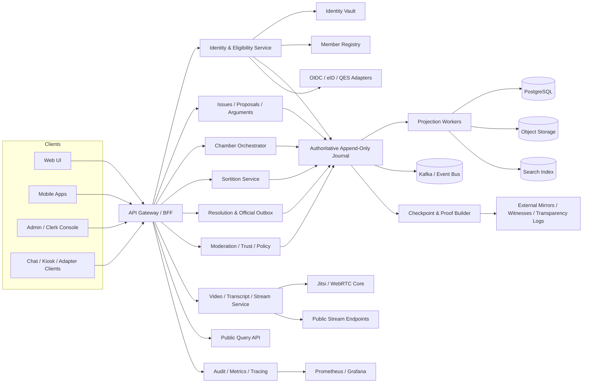
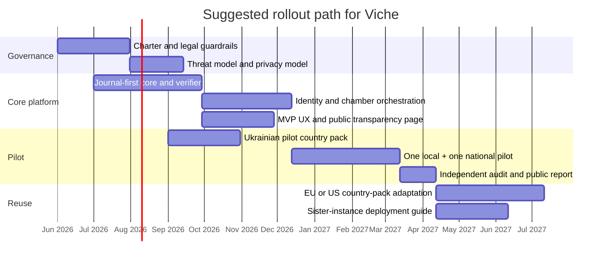

# Viche Public Memorandum

## Executive Summary

“Viche” (Віче) should be designed as a non-electoral civic superstructure: an NGO-operated public deliberation and accountability infrastructure that can collect issues, convene randomly selected chambers, produce signed recommendations, and track official responses without seeking sovereign authority or candidate power. This framing is consistent with the institutional direction documented by entity["organization","OECD","intergovernmental organization"] and with concrete sortition-based assemblies in entity["country","Ireland","country in Europe"] and entity["country","France","country in Europe"], where randomly selected citizens were asked to learn, deliberate, and recommend rather than replace elected institutions. citeturn0search4turn23search0turn24search0turn25search4

The core design thesis is this: Viche should behave less like a social network and more like a civic operating system. Its legitimacy should come from four properties used together: large membership, high-integrity process, public verifiability, and a hard constitutional self-limitation against electioneering, candidate promotion, party campaigning, unlawful investigations, and law-breaking. In several jurisdictions, NGO and charity law already gives strong reasons for such limits; for example, U.S. 501(c)(3) organizations are prohibited from intervening in political campaigns, while in entity["country","Ukraine","country in Europe"] public associations are a lawful organizational vehicle for civic activity. Data minimization and purpose limitation should be built in from the start to align with general privacy-law expectations such as those expressed in EU GDPR principles. citeturn9search0turn9search2turn9search5

Technically, Viche should be open-source, multilingual, API-first, and country-pack driven. The first pilot may be Ukrainian, but the core should be portable: language tags, locale data, identity adapters, signature adapters, admin-boundary models, and official-correspondence connectors should all be pluggable. entity["organization","W3C","web standards consortium"] internationalization guidance, Unicode CLDR locale data, and IETF BCP 47 language tags are the correct foundation for that portability. citeturn18search0turn18search1turn18search2turn18search16

The most important technical requirement is not “blockchain” in the cryptocurrency sense, but authoritative cryptographic accountability. Every state-changing civic action that matters — enrollment, sortition, chamber assignment, vote finalization, resolution issuance, official response receipt, moderator sanction, policy change, software release, and audit event — should be written to an append-only, tamper-evident journal with external checkpoints and independent mirrors. Existing standards and projects already demonstrate the model: JSON canonicalization for reproducible hashing, certificate-transparency-style Merkle logging, Rekor-style inclusion proofs, and TUF/Sigstore-style software integrity. citeturn27search0turn5search1turn5search6turn5search3turn5search0turn21search6

## Principles, Scope, and Concise Requirements

Viche’s public philosophy should be simple enough to explain in one minute and strict enough to survive political pressure. It should say, plainly, that Viche is not a party, not a shadow cabinet, not a campaign machine, and not a law-enforcement substitute. It is a civic instrument for structured issue intake, public deliberation, signed recommendations, and visible accountability requests directed at offices and institutions from the local level to the national level. That is much closer to the “institutionalized deliberation” models described by the OECD than to plebiscitary populism. citeturn23search0turn23search4

### Foundational Principles

1. **Mass legitimacy over charismatic legitimacy.**  
   Membership scale matters. The system should be designed to organize large numbers of members into productive structures rather than celebrate a small class of civic stars.

2. **Rotation over careerism.**  
   Terms should be short, repeated service should be capped, and continuity should be engineered without allowing a permanent political class to form.

3. **Deliberation before recommendation.**  
   Viche should not treat raw sentiment as equivalent to a chamber’s considered recommendation.

4. **Pseudonymity in public, strong identity at the boundary.**  
   The platform should know who is eligible, but the public does not need to see every real legal identity.

5. **API-first, client-agnostic design.**  
   Web, mobile, chat adapters, kiosks, and third-party civic clients should all consume the same core platform APIs.

6. **Country portability without global centralization.**  
   One shared codebase, many country instances. No requirement that all countries share one operational backend.

7. **Verifiability over trust-me administration.**  
   Operators may host the system, but they must not be able to rewrite the past silently.

8. **Legal restraint by design.**  
   No electioneering, no candidate endorsements, no unlawful investigative behavior, no covert evidence operations, no doxxing, no promises of legal force that the law does not grant.

### Concise System Requirements

1. Viche **shall** maintain a verifiable membership and eligibility registry with pluggable identity adapters.
2. Viche **shall** issue pseudonymous civic identifiers distinct from legal identity records.
3. Viche **shall** support issue intake, duplicate detection, alternative proposals, argument mapping, evidence attachment, and official-response tracking.
4. Viche **shall** support district, city, region, and national chambers, each with short rotating mandates.
5. Viche **shall** run publicly auditable sortition using frozen eligibility snapshots and verifiable randomness inputs.
6. Viche **shall** support live deliberation sessions, public viewing, captions, transcripts, and moderated public question intake.
7. Viche **shall** produce signed resolutions, dissent notes, and response deadlines for public offices.
8. Viche **shall** store all authoritative state transitions in append-only tamper-evident journals.
9. Viche **shall** expose a versioned public API and event feeds for external clients and auditors.
10. Viche **shall** be multilingual at the schema, UI, content, and moderation layers.
11. Viche **shall** enforce policy limits such as non-electioneering and legal/role constraints through policy-as-code and human governance.
12. Viche **shall** support independent verification of journal integrity, sortition outcomes, and software artifacts.

### Concise Non-Functional Requirements

1. **Security:** public-key-grade user authentication, service authentication, release signing, and key isolation.
2. **Auditability:** deterministic serialization, immutable evidence trails, and third-party verification.
3. **Privacy:** separation of identity vaults from civic activity; minimal PII on the main platform.
4. **Portability:** country adapters for identity, signatures, legal notices, and administrative boundaries.
5. **Resilience:** mirrorable journals, tested backups, failover for media and API services.
6. **Accessibility:** keyboard-first, screen-reader compatible, caption-first live sessions, low-bandwidth mode.
7. **Scalability:** graceful path from city pilot to national multi-chamber operation.
8. **Operability:** metrics, tracing, log visibility, incident runbooks, release rollback, and public status reporting.
9. **Transparency:** public proofs for state changes, public charters for moderation and weighting.
10. **Composability:** all clients and adapters replaceable without rewriting core rules.

A useful revenue model follows directly from the scope. Viche should be financed through member dues, recurring donations, grants, institutional sponsorships for public-interest infrastructure, and paid support/deployment services for sister organizations — not advertising, data brokerage, pay-for-access politics, or candidate-linked funding. The annual budget, donor categories, software releases, and governance decisions should themselves be journaled and published.

## Institutional Model, Chamber Design, and Participation Math

The most robust institutional pattern for Viche is not one giant all-purpose “citizens’ parliament,” but a multi-level network of short-lived chambers and issue panels. The OECD’s institutionalization guidance is especially relevant here, because it explicitly describes combinations of standing assemblies with one-off panels, links to committees, and sequenced deliberation throughout the policy cycle. That is the correct family of models for Viche. citeturn23search0turn23search1

A practical chamber structure would look like this:

- **District chambers** for neighborhood services, schools, utilities, local policing interactions, local works, and recurring complaints.
- **City chambers** for transport, planning, procurement concerns, environmental nuisances, public service reliability, and mayoral/council-facing recommendations.
- **Region chambers** for hospitals, regional infrastructure, inter-city transport, emergency response performance, and governor/assembly-facing recommendations.
- **National chambers** for ministries, large reforms, national institutions, and cross-jurisdictional civic priorities.

The chamber sizes should be designed for real deliberation, not theatrical symbolism. The experience of public assemblies in Ireland and France suggests that 99–150 selected citizens is feasible for formal assemblies, but many practical issue cells should be smaller for frequent operation. For Viche, standing agenda/review bodies should usually stay between roughly 25 and 75 members, while issue-specific deliberative panels can run between roughly 24 and 60 members. National plenary-style recommendations may aggregate outputs from multiple smaller panels rather than require one giant live room. citeturn24search0turn25search4

The mandate length should probably be much shorter than a year. For volunteer citizens, a year is close to a part-time job. A more realistic baseline is:
- district and city issue panels: **6–8 weeks**
- region and national issue panels: **8–12 weeks**
- agenda triage/review cells: **4–6 weeks**
- official facilitators or clerks: longer continuity roles, but professionally bounded and heavily audited

### Participation Targets and Lottery Math

Let:

- \( M \) = eligible Viche members in a jurisdiction
- \( s \) = seats filled per cycle
- \( c \) = cycles per year
- \( T \) = number of years in horizon
- \( P \) = chance of at least one selection in that horizon

Then, approximately:

\[
P = 1 - \left(1 - \frac{s}{M}\right)^{cT}
\]

For small \( s/M \), a useful approximation is:

\[
P \approx 1 - e^{-scT/M}
\]

If the organization wants to guarantee a target participation probability \( q \) over \( T \) years, the required annual mandate budget \( K \) is:

\[
K \ge -\frac{M}{T}\ln(1-q)
\]

and for small \( q \):

\[
K \approx \frac{Mq}{T}
\]

This is the single most important anti-illusion formula in the whole design. If participation chances are effectively near zero, the institution will feel fake.

### Sample Participation Calculations

| Eligible members \(M\) | Target chance \(q\) | Horizon \(T\) | Required seats/year \(K\) | Seats/quarter |
|---|---:|---:|---:|---:|
| 100,000 | 10% | 5 years | 2,107 | 527 |
| 1,000,000 | 5% | 10 years | 5,129 | 1,282 |
| 5,000,000 | 10% | 10 years | 52,680 | 13,170 |

The implication is clear: Viche must run **many** short-lived panels across levels, not one rare ceremonial chamber. That is also what makes “massivity” technically plausible.

### Rotation With Bounded Return

The user idea that “good candidates may return with more support” is workable only if it is tightly bounded. Otherwise the platform quietly recreates an elite. The safest design is:

- **80–90% of seats** drawn from a fresh eligible pool
- **10–20% of seats** drawn from a prior-service alumni pool
- alumni weight multiplier **capped** at a small factor, for example 1.10–1.25
- **no consecutive terms** at the same level
- **cooldown periods** between mandates
- all weights, caps, and random inputs **public and auditable**

This gives continuity without creating professional Viche politicians.

## Technical Architecture

The central architectural decision should be **journal-first, projection-second**. In other words, authoritative civic events are committed to a tamper-evident append-only journal first, and user-facing relational views are then derived from it. This differs from ordinary CRUD civic platforms and is the main reason Viche can honestly claim that administrators cannot silently rewrite history. The design draws on existing building blocks rather than novelty for its own sake: urlWebAuthn Level 3turn1search2, urlOpenID Connect Coreturn2search0, urlOAuth 2.0turn3search0 with urlOAuth Security BCPturn3search14 and urlPKCEturn15search4 for clients; urlMatrix Specificationturn10search12, urlJitsi self-hosting guideturn4search1, and urlWebRTC 1.0turn10search17 for communications; urlPostgreSQL replicationturn7search0, urlSQLite WALturn7search3, and urlApache Kafkaturn7search14 for durable state and event distribution; and urlPrometheusturn6search7 plus urlGrafana Alertingturn7search17 for operations. citeturn1search2turn2search0turn3search14turn10search12turn4search1turn7search0turn7search3turn7search14turn6search7turn7search17

### Core Domain Model

The minimum core entities should be:

- **LegalIdentity** — isolated identity-vault record; not exposed on general reads
- **Member** — pseudonymous civic account linked to eligibility status
- **Jurisdiction** — district/city/region/national hierarchy
- **Chamber** — standing or issue-bound body with mandate rules
- **Mandate** — a member’s specific term in a chamber
- **Issue** — civic problem or question
- **Proposal** — one candidate recommendation or alternative
- **Argument** — pro/con claim linked to proposal and evidence
- **EvidenceItem** — document, source, clip, transcript segment, or official attachment
- **SortitionRun** — frozen eligibility snapshot, public randomness inputs, weighted outcome
- **Session** — deliberation meeting with agenda, transcript, and video links
- **Resolution** — signed chamber output, including dissent notes
- **OfficialMessage** — outgoing requests and incoming official responses
- **JournalRecord** — authoritative immutable event
- **Checkpoint** — Merkle checkpoint exported to mirrors
- **PolicyDecision** — machine-enforced governance decision for access or moderation

### UX Primitives

The user-facing primitives should stay simple and reusable across all clients:

- **Issue card** — title, jurisdiction, urgency, support level, alternatives, official status
- **Alternative set** — mutually exclusive proposals grouped under one issue
- **Deliberation room** — agenda, live video, speaker queue, briefing pack, question queue
- **Resolution tracker** — final recommendation, deadlines, outgoing letters, official replies
- **Transparency proof panel** — journal hash, checkpoint ID, verification receipt
- **Member panel** — eligibility status, service history, privacy options, mandate notices
- **Public watch mode** — live captions, transcript search, selected question feed
- **Moderator console** — sanctions, appeals, evidence routing, disclosure logs

### Journal Record Schema

The authoritative journal record should be deterministic and cryptographically reproducible. Canonical JSON should follow RFC 8785 before hashing and signing. citeturn27search0

| Field | Type | Notes |
|---|---|---|
| `journal_id` | UUID / string | Distinguishes journal streams if multiple exist |
| `sequence_no` | uint64 | Strictly increasing within `journal_id` |
| `record_id` | UUID | Stable public identifier |
| `aggregate_type` | enum | e.g. `issue`, `mandate`, `resolution`, `moderation_decision` |
| `aggregate_id` | UUID | Domain object the event belongs to |
| `event_type` | enum | e.g. `ISSUE_CREATED`, `SORTITION_FINALIZED` |
| `occurred_at` | timestamp | Event time |
| `received_at` | timestamp | Ingress time |
| `actor_type` | enum | `member`, `service`, `official_account`, `moderator` |
| `actor_id` | string | Pseudonymous or service identity |
| `jurisdiction_id` | UUID | Scope |
| `payload_c14n` | bytes / text | Canonicalized JSON view |
| `payload_hash` | bytes | Hash of canonical payload |
| `prev_record_hash` | bytes | Hash of previous record in chain |
| `record_hash` | bytes | Hash over header + payload hash + previous hash |
| `signature_alg` | enum | e.g. `Ed25519` |
| `signature` | bytes | Detached signature over canonical record envelope |
| `key_id` | string | Signing key identifier |
| `visibility` | enum | `public`, `restricted`, `sealed` |
| `redaction_ref` | nullable string | If public view hides sealed material |
| `proof_ref` | nullable string | Inclusion proof / checkpoint reference once anchored |

The related **checkpoint** object should include: checkpoint ID, journal ID, last sequence number, Merkle root, checkpoint timestamp, signing key ID, signature, and external publication receipts.

### API Surface

The public API should be versioned from day one, with protobuf/gRPC or async events internally if desired, but a stable JSON/HTTP public contract externally.

| Endpoint | Method | Purpose | Auth |
|---|---|---|---|
| `/v1/auth/oidc/start` | GET | Begin browser-based auth | public |
| `/v1/auth/webauthn/register` | POST | Register passkey / security key | OIDC session + step-up |
| `/v1/auth/webauthn/assert` | POST | Strong-auth assertion | public / session recovery |
| `/v1/auth/qes/challenge` | POST | Challenge for QES/eID signing | member |
| `/v1/auth/token` | POST | Token exchange / refresh | OIDC / client |
| `/v1/me` | GET | Member profile and eligibility state | member |
| `/v1/jurisdictions` | GET | Jurisdiction tree and metadata | public |
| `/v1/issues` | GET/POST | Search or submit issues | public read / member write |
| `/v1/issues/{id}` | GET/PATCH | Read or update issue metadata | public read / role-based write |
| `/v1/issues/{id}/alternatives` | GET/POST | Manage competing proposals | public read / member write |
| `/v1/issues/{id}/arguments` | GET/POST | Add structured arguments/evidence | public read / member write |
| `/v1/chambers` | GET | List active chambers | public |
| `/v1/chambers/{id}` | GET | Chamber details and membership policy | public |
| `/v1/chambers/{id}/sessions` | GET/POST | Session schedule and facilitation info | public read / clerk write |
| `/v1/chambers/{id}/votes` | POST | Cast chamber vote / stance | member with mandate |
| `/v1/sortitions` | GET/POST | Create and inspect sortition runs | public read / privileged create |
| `/v1/sortitions/{id}/proof` | GET | Eligibility snapshot hash, seed inputs, outcome proof | public |
| `/v1/resolutions` | GET/POST | Read or publish resolutions | public read / chamber role write |
| `/v1/resolutions/{id}/official-messages` | GET/POST | Outgoing letters and incoming replies | public read / clerk or official write |
| `/v1/journals/{id}/records` | GET | Stream verifiable records | public |
| `/v1/journals/{id}/checkpoints` | GET | Fetch Merkle checkpoints | public |
| `/v1/moderation/reports` | POST | Abuse reports / legal complaints | member |
| `/v1/policies/decisions` | GET | Public policy registry and versions | public |
| `/v1/events/stream` | SSE / WebSocket | Realtime public event feed | public |
| `/v1/admin/*` | mixed | Restricted operational functions | admin with strong auth + mTLS |

### Existing OSS Platforms to Reuse Selectively

Viche should not start from a blank page, but it also should not assume a turnkey civic suite already exists. Existing tools are useful precedents with gaps:

- urlDecidimturn14search0 is a mature participatory-democracy framework and exposes a GraphQL API, but its default model is not journal-first and its API has historically emphasized read access. citeturn14search20turn26search0
- urlCONSUL DEMOCRACYturn14search1 is strong on proposals, consultations, and participatory processes, but again not built around cryptographic append-only authority. citeturn14search1turn14search5
- urlPolisturn14search2 is excellent for large-scale statement clustering and finding opinion structure, but it is not a full mandate/chamber/legal-correspondence platform. citeturn26search1
- urlLoomioturn14search3 is very good at clear group decisions and preserving decision records, but it is aimed at smaller-group coordination. citeturn14search19

The right approach is selective borrowing: idea intake patterns from Decidim/CONSUL, large-scale opinion discovery from Polis, and discussion/decision ergonomics from Loomio — inside a Viche-specific cryptographic and jurisdictional core.

## Security, Cryptography, Identity, Privacy, and Anti-Manipulation

### Cryptographic Profile

For application-layer cryptography, the safest default profile is:

- **Ed25519** detached signatures for journal records, checkpoints, and signed public receipts
- **XChaCha20-Poly1305** or equivalent modern AEAD for encrypting sensitive object payloads at the application layer
- **Argon2id** for any password fallback or local secret derivation
- **TLS 1.3** via OpenSSL for transport security and PKI interoperability
- **RFC 8785 canonical JSON** before record hashing/signing
- **SHA-256 Merkle trees** for transparency proofs and compatibility with CT-style tooling

This profile is practical because it relies almost entirely on mature well-documented primitives already implemented in urllibsodiumturn1search20 and urlOpenSSL documentationturn1search1. Libsodium documents Ed25519 signatures and Argon2id-backed password hashing directly; OpenSSL remains the workhorse for TLS and certificate operations. citeturn22search0turn22search1turn1search1turn27search0

### Append-Only Tamper-Evident Journals

Viche should explicitly reject the model “the database is the source of truth.” The source of truth should be the **verifiable journal**, and relational tables should be rebuildable projections.

The closest mature analogues are certificate transparency and transparency-log systems for software supply chains. RFC 9162 describes CT v2 as a publicly auditable Merkle logging protocol; Trillian generalizes CT ideas for arbitrary append-only data; Rekor exposes log APIs and inclusion/integrity verification; and TUF/Sigstore address trust bootstrapping and software update integrity. These are stronger and more directly relevant precedents than generic blockchain rhetoric. citeturn5search1turn5search6turn5search3turn5search7turn5search0turn21search6

In practice, Viche should do the following:

1. Canonicalize journal payloads with RFC 8785.
2. Hash-chain every record to the prior record in the journal.
3. Sign each record envelope with a service key.
4. Build periodic Merkle checkpoints over journal ranges.
5. Publish signed checkpoints to at least **three** independent external places:
   - public transparency endpoint
   - partner NGO mirror
   - artifact/release transparency log or immutable mirror store
6. Offer a public verifier CLI and API so anyone can test continuity and inclusion.

A server administrator may still destroy a server. What they must **not** be able to do is silently rewrite the past.

### Identity and Authentication Options

Viche should support identity in layers, not as one ideological choice.

**Baseline layer:**  
Use urlKeycloakturn16search1 or an equivalent OSS identity broker implementing urlOpenID Connect Coreturn2search0 and OAuth 2.0, with browser/native best practices from RFC 8252 and PKCE. Native clients should rely on urlAppAuthturn16search2 or equivalent RFC-aligned SDKs. Authenticators should default to passkeys/security keys via urlWebAuthn Level 3turn1search2. Identity-assurance policy should be mapped using a framework like urlNIST SP 800-63-4turn3search9 rather than one flat “verified/unverified” flag. citeturn16search1turn16search19turn2search0turn3search0turn15search1turn15search4turn1search2turn3search9

**National adapter layer:**  
Where strong digital identity exists, plug it in. For a Ukrainian pilot that means adapters for urlDiia.Signatureturn8search0, urlBankID NBUturn8search1, and the Ukrainian trusted-list / qualified trust-service ecosystem. In the entity["organization","European Union","political union"] context, the architecture should anticipate national eID and wallet integrations under the new EUDI framework; the Commission explains that wallets will build on national identity systems, not replace them from scratch. citeturn8search0turn8search1turn8search2turn8search3turn8search13turn8search6

**Portable credential layer:**  
Use urlDID Coreturn12search0 and urlVC Data Model 2.0turn11search1 only where they create portability benefits — for example, delegate credentials, role attestations, or auditable membership proofs. They should be optional in the MVP, not the only path to access. The W3C VC 2.0 family is useful partly because it is designed to work with mainstream signing/encryption ecosystems such as JOSE/COSE and selective disclosure mechanisms. citeturn12search0turn11search1turn11search5

### Pseudonymity and Privacy Trade-Offs

Viche should split identity into at least three trust zones:

- **Identity Vault** — real person data, eID assertions, recovery procedures
- **Civic Identity Layer** — pairwise pseudonymous member IDs and mandate IDs
- **Public Layer** — chamber outputs, transcripts, and visible activity under pseudonyms or role labels

This separation is the correct compromise between anti-Sybil integrity and reasonable anonymity. It also aligns with privacy principles of data minimization, purpose limitation, and storage limitation. For most public proceedings, the chamber participant does not need to be publicly deanonymized. Exceptions should be narrow and rule-bound, such as named official officeholders or elected internal governors who voluntarily accept disclosure. citeturn9search5turn11search1turn11search5

### Publicly Verifiable Sortition

Sortition must not depend on “the admin clicked random.” It should be deterministic and replayable.

A sound recipe is:

\[
seed = H(snapshot\_hash \parallel drand\_value \parallel nist\_pulse \parallel local\_hsm\_nonce \parallel run\_metadata)
\]

Where:
- `snapshot_hash` = canonical hash of the frozen eligible-set snapshot
- `drand_value` = public distributed randomness beacon output
- `nist_pulse` = public timestamped randomness pulse
- `local_hsm_nonce` = locally generated one-time entropy committed before reveal

Both drand and NIST explicitly position their randomness beacons as public-verifiability tools for randomized procedures, and NIST’s beacon materials emphasize hash-chaining, signatures, and audit-friendly pulse structures. citeturn28search2turn28search3turn28search9turn28search5

### Threat Model and Primary Mitigations

| Threat | Consequence | Primary Mitigation |
|---|---|---|
| Identity fraud / Sybil attack | fake members, fake support | strong eligibility proofing, one-member-one-seat rules, device-bound auth, anomaly detection |
| Admin tampering with history | silent rewriting of records | journal-first architecture, hash chaining, Merkle checkpoints, external mirrors |
| Sortition manipulation | biased chamber composition | frozen snapshots, public seed inputs, deterministic replay, independent verifier |
| Bot brigading and coordinated commenting | sentiment distortion, intimidation | rate limits, staged trust, language-aware abuse filters, human moderation queue |
| Moderator capture or abuse | hidden censorship | moderator actions journaled, dual control, appeals, policy-as-code |
| Supply-chain compromise | backdoored releases | signed artifacts, TUF metadata, Sigstore/Cosign, reproducible builds where practical |
| Service-to-service impersonation | lateral movement | mTLS, SPIFFE/SPIRE workload identity, least-privilege service policies |
| Doxxing / coercion of chamber members | chilling effect, safety risk | public pseudonyms, sealed identity vault, threat reporting workflow, selective redaction |
| Official-account spoofing | fake “government replies” | institutional account verification, domain and signature validation, signed correspondence |
| DDoS / media disruption | failed sessions, public distrust | CDN edge, backup broadcast paths, session failover, async transcript continuity |
| Data exfiltration | privacy harm | app-layer encryption, compartmentalized secrets, audited admin access |
| Incentive gaming of repeat selection | soft elite formation | fresh-seat quotas, capped alumni weighting, cooldown rules, public weight formulas |

The technical control plane for many of these rules should rely on urlOpen Policy Agentturn19search2, while workload identity should use urlSPIFFE/SPIREturn20search1 or equivalent mTLS-backed service identity. OPA is explicitly a general-purpose policy engine, and SPIRE is a production-ready SPIFFE implementation for workload attestation and SVID issuance. citeturn19search2turn19search3turn20search1turn20search2turn3search16

## Deployment Model, Operations, and Recommended OSS Stack

Viche should be deployed as a **country-scoped NGO instance**, not as one global shared backend. Each country instance should have its own legal holder, trust domain, keys, moderation charter, data boundary, and official-integration adapters. Shared code is fine; shared sovereignty is not.

### Deployment Tiers

**Tier A — city or province pilot**
- 1 country instance
- 1 Keycloak realm or equivalent
- 1 PostgreSQL primary + backup
- object storage
- Jitsi/WebRTC node
- journal service + mirror publisher
- no Kafka at first unless event volume justifies it
- background workers and outbox pattern instead of microservice sprawl

**Tier B — national NGO rollout**
- multiple API replicas
- PostgreSQL HA and read replicas
- dedicated journal/projection workers
- Kafka or equivalent replicated event bus
- more than one media node
- public verifier endpoint and mirror witnesses
- formal incident response and moderator escalation

**Tier C — federation-ready national platform**
- one trust domain per country
- standardized issue/resolution exchange format
- optional cross-instance artifact transparency and software distribution
- no default cross-country member identity federation

### Recommended OSS Stack and Integration Points

| Function | Preferred Stack | Why it fits Viche |
|---|---|---|
| User auth broker | urlKeycloakturn16search1 | mature OSS OIDC/SAML broker with strong app integration |
| Native/mobile auth | urlAppAuthturn16search2 | RFC-aligned native OAuth/OIDC client flows |
| Strong user auth | urlWebAuthn Level 3turn1search2 | scoped public-key credentials / passkeys |
| National digital identity | urlDiia.Signatureturn8search0, urlBankID NBUturn8search1, EUDI adapters | strong-country integration path |
| Workload identity | urlSPIFFE/SPIREturn20search1 | service authentication and attestation |
| Policy enforcement | urlOpen Policy Agentturn19search2 | policy-as-code for roles and legal constraints |
| Crypto library | urllibsodium docsturn1search20 | modern high-level crypto primitives |
| TLS / PKI | urlOpenSSL docsturn1search1 | transport security, cert tooling |
| Append-only transparency | urlRFC 9162turn5search1, urlRekorturn5search3, Trillian references | public proofs and log verification |
| Release integrity | urlTUF specificationturn5search0, urlSigstore/Cosignturn21search1 | defend against compromised repos/keys |
| Primary relational store | urlPostgreSQL replication docsturn7search0 | durable transactional core, HA path |
| Local/offline store | urlSQLite WALturn7search3 | portable edge caches and offline-first clients |
| Event streaming | urlApache Kafkaturn7search14 | replicated append-only event distribution at scale |
| Federation/chat signaling | urlMatrix Specificationturn10search12 | open messaging and room topology if needed |
| Live video | urlJitsi self-hostingturn4search1 + urlWebRTC 1.0turn10search17 | self-hostable deliberation sessions |
| Content-addressed archives | urlIPFS docsturn4search15 | optional mirror/archive layer, not primary DB |
| Monitoring | urlPrometheusturn6search7 + urlGrafana Alertingturn7search17 | metrics and incident visibility |
| Civic-tech inspirations | urlDecidimturn14search0, urlCONSUL DEMOCRACYturn14search1, urlPolisturn14search2, urlLoomioturn14search3 | selective reuse of participation and deliberation patterns |

The row above is not a call to deploy everything on day one. It is a staged toolkit. The early technical ideal for Viche is **boring correctness**: journal integrity, identity separation, chamber orchestration, and official-response tracking before platform sprawl. The capabilities summarized above come directly from the official project documentation and standards pages. citeturn16search1turn16search2turn1search2turn20search1turn19search2turn1search20turn5search1turn5search3turn5search0turn7search0turn7search3turn7search14turn10search12turn4search1turn6search7turn7search17

### Deployment and Ops Checklist

1. **Legal**
   - charter adopted
   - no-electioneering clause
   - privacy notice and retention schedule
   - moderator due-process policy
   - official-response and defamation handling rules

2. **Keys and Secrets**
   - root signing keys isolated
   - operational keys rotated
   - SoftHSM or HSM path defined for critical signing roles
   - recovery ceremonies documented
   - emergency revocation path tested

3. **Build and Release**
   - artifacts signed
   - dependency lockfiles enforced
   - release manifests versioned
   - verification step mandatory before deploy
   - rollback procedure tested

4. **Data and Journals**
   - authoritative journal backups tested
   - external checkpoint publication working
   - public verifier endpoint live
   - restore-from-journal exercise completed
   - retention classes defined for public vs sealed records

5. **Availability**
   - API health checks
   - media failover
   - degraded-mode read-only public portal
   - queue-based retry for official correspondence
   - backup moderators and clerks on-call

6. **Observability**
   - metrics, logs, traces
   - error budgets
   - integrity alerts for checkpoint failures
   - abuse-rate dashboards
   - public status page

7. **Human Operations**
   - facilitator training
   - moderator training
   - threat-report channel
   - appeal workflow
   - public annual audit and governance report

## Localization, Country Packs, Rollout Strategy, MVP, and Next Steps

Internationalization should be treated as a core architecture concern, not a translation afterthought. BCP 47 language tags, Unicode CLDR locale data, and W3C internationalization practices should be used for every UI string, stored content language marker, and locale-sensitive format. All user-generated content should carry a source-language tag; machine translations should be stored as derived artifacts, never overwrite originals; and reviewed/human translations should be tracked as explicit versions. citeturn18search0turn18search1turn18search2turn18search8turn18search16

### Country-Pack Model

A country pack should contain:

- supported locales and scripts
- jurisdiction hierarchy model
- time zone defaults
- legal notices and moderation rules
- campaign/election prohibitions
- identity adapters
- signature/trust-service adapters
- official-correspondence connectors
- civic process templates
- moderation lexicons and abuse patterns per language
- seal/signature verification policy

For a Ukrainian pilot, the country pack should start with Ukrainian as the default language, multilingual overlays for English and other needed audiences, adapters for Diia.Signature and BankID NBU, and support for Ukrainian qualified trust-service lists. Because Ukraine and the EU now have cross-border trust-service recognition channels in parts of the signature ecosystem, the architecture should not hardcode a purely national signature worldview. citeturn8search0turn8search1turn8search2turn8search6

For an EU deployment, the instance should be designed around national eID plus EUDI wallet evolution rather than assuming one Brussels-based identity authority. For a entity["country","United States","country in North America"] deployment, the practical early path is usually OIDC + WebAuthn + local proofing partnerships rather than waiting for any universal public eID layer.

### Legal and Ethical Constraints

Viche should encode the following hard constraints in both charter and policy engine:

- it **must not** endorse, advertise, rate, or coordinate support for candidates or parties
- it **must not** run electoral campaigns or campaign-finance tooling
- it **must not** conduct covert investigations, hacking, unlawful surveillance, or doxxing
- it **must not** encourage harassment of officials or citizens
- it **must not** present an accusation against a named person as a verdict
- it **may** request documents, publish recommendations, publish office-level response tracking, and route complaints to lawful institutions

This is prudent both normatively and legally. It prevents Viche from mutating into a party-machine while preserving space for serious civic participation, public accountability requests, and deliberative recommendation-making. citeturn9search0turn9search2turn9search5

### Minimal Viable Product Scope

The MVP should be intentionally narrow. It should include only what is necessary to prove that the civic operating model works.

1. Member enrollment with OIDC + WebAuthn
2. One national identity adapter for the pilot country
3. Jurisdiction tree and chamber registry
4. Issue intake with duplicate and alternative linking
5. One sortition engine with public proof receipts
6. One live chamber workflow with transcript and public watch mode
7. Signed resolutions and official-response tracker
8. Journal-first event store with checkpoints and one external mirror
9. Public verification page and CLI/API
10. Ukrainian-first UI with multilingual string framework
11. Basic moderation, appeals, and role policy enforcement

The MVP should **not** include, initially:
- full decentralized identity stack as a required dependency
- global federation of country instances
- token economics or blockchain dependency
- complex algorithmic feed ranking
- nationwide simultaneous chamber operation
- fully automated semantic moderation

### Suggested Next Steps

1. Publish a public charter declaring scope, non-scope, and legal self-restraint.
2. Create the protocol repository and write the journal, sortition, and chamber specs before building flashy UX.
3. Prototype the journal service and public verifier first; this is the trust anchor.
4. Build a narrow Ukrainian pilot with one city/region process and one national thematic chamber.
5. Run an independent security review of identity separation, randomness, and journal integrity.
6. After one public pilot, open a country-pack interface and document how another NGO in an EU state or the U.S. can launch a sibling instance.

The strategic conclusion is straightforward. Viche is viable if it is built as a lawful, mass-participation, journal-first civic platform — not as an app for opinion polling, not as a pseudo-state, and not as a campaign vehicle. The architecture should be conservative where trust is at stake and flexible where localization is needed. If the first public pilot can prove four things — fair sortition, real deliberation, signed outputs, and non-rewritable history — then the concept can realistically travel from Ukraine to other countries without losing its core identity.