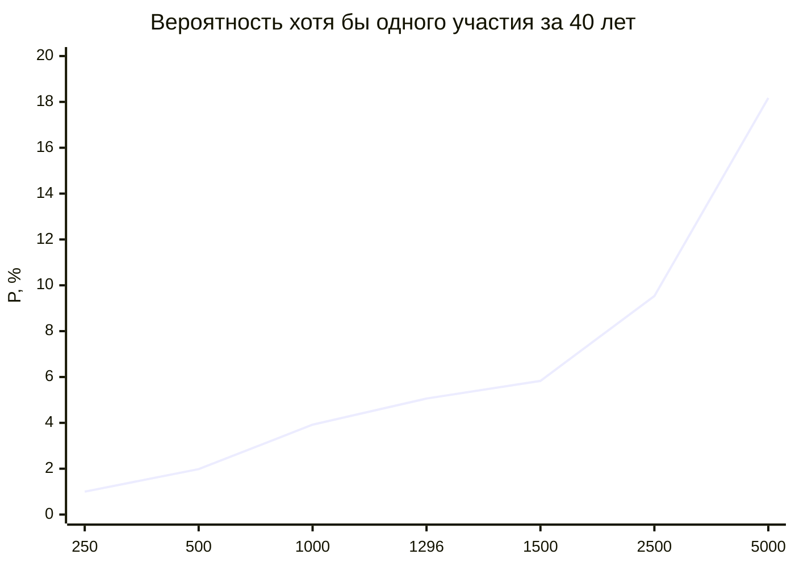
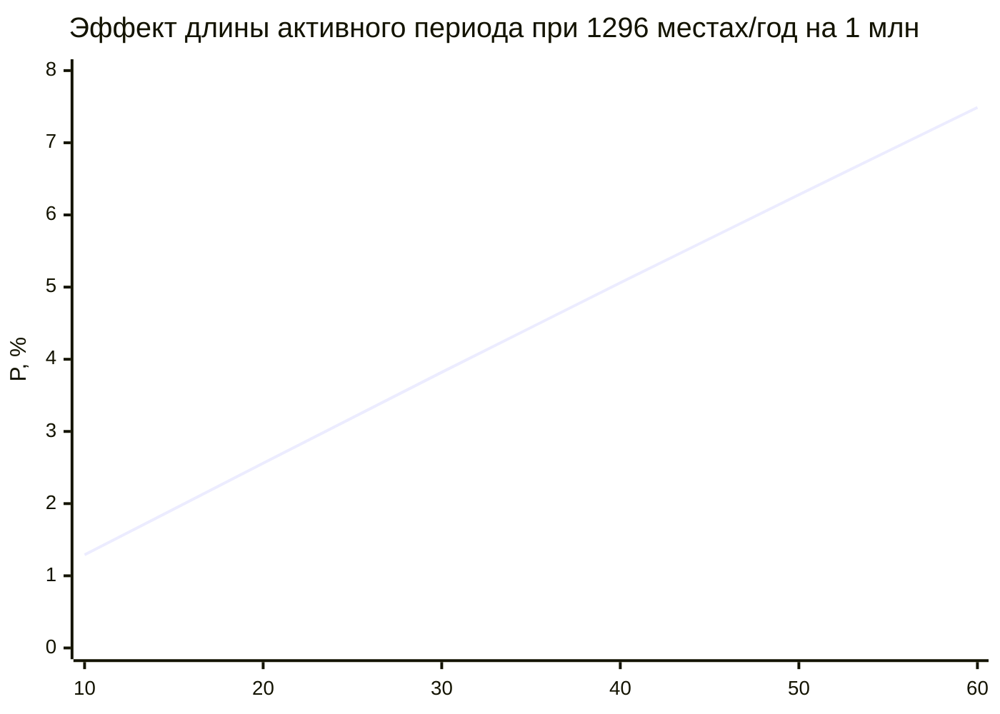
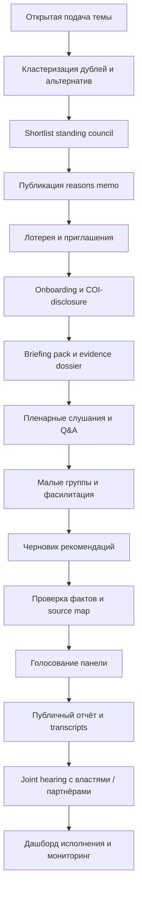

# Многоуровневая сортировочная deliberative ГО

## Executive summary

По совокупности академической литературы, официальных стандартов и практических кейсов наиболее жизнеспособная модель для гражданской надстройки над классической демократией — это не «второй парламент, который заменяет избранный парламент», а **постоянная многоуровневая deliberative-инфраструктура**, связанная с формальной политикой через обязательство публичного ответа, мониторинг исполнения и открытый след решений. Именно так сходятся рекомендации entity["organization","OECD","intergovernmental organization"], логика работ entity["people","Джеймса Фишкина","deliberative democracy scholar"], критика entity["people","Кристины Лафонт","political philosopher"] и опыт entity["country","Ирландии","country"], entity["country","Франции","country"] и entity["place","Остбельгии","belgian german-speaking region"]. citeturn23view0turn23view1turn23view2turn22view0turn21view0turn24view0turn24view1turn18view0turn25view0turn25view1turn26view1turn20view0

Главный практический вывод для вашего замысла такой: **интерес граждан упирается не столько в «идею жребия», сколько в реальный шанс быть приглашённым хотя бы раз за активную жизнь**. Национальный-only формат почти всегда даёт ничтожную вероятность участия. Поэтому масштабирование должно идти через четыре уровня — район/громада → город → область/регион → национальный уровень — с нормированной квотой приглашений на 1 млн населения. В базовом сценарии этого отчёта приблизительно **1 300 мест в deliberative-панелях в год на 1 млн жителей** дают около **5% шанса хотя бы одного участия за 40 лет**; чисто национальная модель с несколькими десятками панелей в год такой вероятности не даст. Этот тезис согласуется и с аргументом Фишкина о том, что репрезентативный «микрокосм» может масштабироваться статистически, но должен быть встроен институционально, а не существовать как редкое шоу. citeturn22view0turn23view2

Технологически разумная архитектура для такой ГО — это: **BankID/КЕП для идентификации, публично проверяемая лотерея на базе randomness beacons, E2E-verifiable голосование для advisory-решений, append-only журналы с Merkle-доказательствами, и Mini App в urlTelegramhttps://telegram.org как быстрый интерфейс уведомлений и кабинета участника**. Но важная оговорка: у криптографически проверяемых интернет-голосований есть хорошие инструменты для **консультативных** процессов, однако для **возврата бюллетеня в государственных выборах** консенсус профильных источников остаётся сдержанным: «блокчейн сам по себе» проблему не решает, а удалённый интернет-возврат бюллетеня сегодня не считается достаточно безопасным. Для вашей модели это означает: высокий уровень криптографии — да; риторика «заменим ЦИК блокчейном» — нет. citeturn33view3turn28view2turn35view0turn28view3turn34view0turn30view0turn30view1turn30view3turn30view4turn32view0

Итоговая рекомендация отчёта: строить такую ГО как **постоянную deliberative civic layer**, зарегистрированную как общественное объединение, с малым постоянным гражданским советом на каждом уровне, частыми предметными панелями по жребию, публичным дашбордом исполнения, API/логами для внешнего аудита и постепенным пилотом от местного уровня к национальному. Это не устраняет избранные органы, а создаёт для них публично видимый слой «обдуманного гражданского суждения», от которого уже трудно отмахнуться. Правовая оболочка для самой ГО в украинском контексте существует в законе о громадских об’єднаннях, а цифровая идентификация и trust-services — в профильном законе про електронну ідентифікацію та електронні довірчі послуги. entity["organization","Верховная Рада Украины","parliament ukraine"] citeturn15search0turn30view4turn30view5

## Что говорит литература и какие выводы из неё следуют

Базовая интеллектуальная рамка здесь следующая. Фишкин описывает deliberative democracy как попытку совместить **политическое равенство** с **обдуманным обсуждением**, а не просто с мгновенным массовым голосом. Его ключевой для дизайна тезис: репрезентативный случайный «микрокосм» может статистически представлять большие популяции; качество зависит не от размера страны, а от **репрезентативности**, **качества информации**, **баланса аргументов**, **модерации** и **реальных последствий** для решения. citeturn22view0

Системный эмпирический каркас даёт OECD. В их обзоре собраны почти 300 representative deliberative practices, а Good Practice Principles фиксируют конструктивный минимум: чёткая цель, публичное обязательство власти ответить, прозрачность, representativeness, inclusiveness, balanced information, достаточное время, privacy и evaluation. Для вашей ГО отсюда следует очень жёсткий вывод: «жребий» без обязательного follow-up, прозрачной процедуры и аудита — это не deliberative institution, а просто красивый ивент. citeturn23view0turn23view1

Важное ограничение даёт Лафонт. Её критика не в том, что мини-публики бесполезны, а в том, что **сильно empowered mini-public**, который начинает как бы «говорить за народ» без постоянной связи с широкой публикой, рискует превратиться в shortcut и ослабить идеал самоуправления. Самый продуктивный режим использования мини-публик у неё — «contestatory, vigilant, anticipatory»: они должны запускать публичный разговор, корректировать повестку, повышать качество аргументации и заставлять избранные институты объясняться, а не подменять собой весь demos. Для дизайна вашей ГО это мощный аргумент в пользу **обязательного парламентского ответа и дашборда исполнения**, но не в пользу немедленной законодательной суверенности. citeturn21view0

Следующий пласт литературы касается институционализации и рисков. OECD прямо рекомендует оценивать не только разовые процессы, но и **постоянные структуры общественной deliberation**, поскольку именно они потенциально сильнее влияют на политику и доверие. Одновременно новейший анализ на примере Ostbelgien показывает, что постоянные мини-публики уязвимы к захвату на этапе agenda-setting, отбора экспертов, фасилитации, передачи рекомендаций и имплементации; особенно опасны низкая медиавидимость, усталость участников и концентрация неформальной власти в секретариате. Отсюда следует центральный проектный принцип: нужна не только лотерея, но и **разделение ролей, checks and balances, независимая оценка и постоянная публичность follow-up**. citeturn23view2turn20view0

Наконец, для локального восточноевропейского контекста полезен новый policy brief по deliberation в Украине: он подчеркивает, что делиберация особенно полезна там, где нужно снижать поляризацию, возвращать чувство агентности и встроить участие граждан в понятный политический процесс, а не просто собирать «комментарии населения». Это хорошо совпадает с задачей вашей ГО как «надстройки», которая делает общественное мнение более связным, а не только более шумным. citeturn13search11

### Приоритетные источники

| Источник | Почему критичен для дизайна |
|---|---|
| OECD, *Innovative Citizen Participation and New Democratic Institutions* | Лучшая сравнительная карта field-level: масштабы, модели, trade-offs, институционализация |
| OECD, *Good Practice Principles for Deliberative Processes* | Короткий нормативный стандарт минимально доброкачественного процесса |
| OECD, *Evaluation Guidelines for Representative Deliberative Processes* | Основа для KPI, доверия, learning loop и внешней верификации |
| Fishkin, *Democracy When the People Are Thinking* | Теоретическая база случайной репрезентативной deliberation |
| Lafont, *Democracy without Shortcuts* | Главная критика чрезмерного empowerment мини-публик |
| Официальные материалы Citizens’ Assembly Ireland | Образцовый пример связи deliberation → парламент → референдум |
| Официальные материалы Convention Citoyenne pour le Climat | Образцовый пример сильной deliberation и слабого политического follow-through |
| Niessen & Reuchamps, *Institutionalising Citizen Deliberation in Parliament* | Лучшее описание permanent sortition model, связанного с парламентом |

Эта восьмёрка даёт достаточно плотный каркас для проектирования: OECD отвечает за стандарты; Fishkin — за microcosm-логику; Lafont — за ограничения; Ireland/France/Ostbelgien — за реальные institutional lessons. citeturn23view0turn23view1turn23view2turn22view0turn21view0turn24view0turn24view1turn18view0turn25view0turn25view1turn26view1

## Сравнительные кейсы и извлечённые уроки

| Кейс | Дизайн | Связь с формальной политикой | Что сработало | Где сломалось |
|---|---|---|---|---|
| Ирландия | 99 случайно выбранных граждан + chair; broad representativeness по census-параметрам; запрет на прямую самозапись и исключение advocacy roles | Рекомендации пошли в Oireachtas; вопрос по 8-й поправке вышел на референдум 2018 года | Высокая делиберативная легитимность, понятный маршрут от assembly к реальному решению | Высокая зависимость от политической воли и темы |
| Франция | 150 граждан, отобранных случайно по телефону, с социальным и территориальным разнообразием; сильный экспертный и процессный контур | Обещание передать предложения «без фильтра» на референдум, в парламент или на прямую имплементацию | Масштаб, общественное внимание, качество коллективной работы, богатый пакет предложений | Политический follow-through оказался слабее обещаний; участники сами связали успех с уважением executive к обещанию |
| Остбельгия | Постоянный Citizens’ Council 24 чел. на 18 месяцев + recurring assemblies 25–50 чел.; joint committees с парламентом и министрами | Парламент обязан рассмотреть рекомендации и мотивировать отказ; есть последующий мониторинг | Самая сильная институционализация: permanence, agenda-setting citizen body, formal follow-up | Риски capture через секретариат, экспертов, фасилитацию, fatigue и низкое медиа-покрытие |

Источники для таблицы: официальные материалы Citizens’ Assembly Ireland по составу и отбору, первый доклад по Eighth Amendment и официальный результат референдума 2018; официальный сайт и summary French Citizens’ Convention on Climate; академическое описание и официальный сайт permanent citizens’ dialogue в Ostbelgien. citeturn24view0turn24view1turn18view0turn25view0turn25view1turn19search1turn26view0turn26view1turn27view0turn27view3turn20view0

Из этих кейсов следует три практически важных урока. Во‑первых, **простая случайная выборка сама по себе не создаёт легитимность**: нужна цепочка *selection → learning → deliberation → recommendation → formal response → public tracking*. В Ирландии она была достаточно чёткой, в Ostbelgien — встроенной, во Франции — риторически сильной, но процедурно ослабленной на этапе исполнения. citeturn24view1turn18view0turn26view1turn25view1

Во‑вторых, **постоянная модель лучше эпизодической**, если ваша цель — не разовая консультация, а гражданская «надстройка», с которой приходится считаться. Ostbelgien важна именно тем, что у неё есть standing council, recurrent assemblies и публичные joint committees. Это ближе всего к вашему замыслу «палат» разных уровней. Но постоянство повышает и риск бюрократизации, поэтому анти-capture механизмы становятся не дополнением, а ядром дизайна. citeturn26view1turn20view0

В‑третьих, **широкая публика должна видеть не только финальный отчёт, но и процесс, и исполнение**. Иначе делиберация становится элитным внутренним ритуалом. Ирландские транскрипты и французские стримы показывают направление, а исследование capture в Ostbelgien прямо указывает, что низкая медиа-видимость облегчает cherry-picking и перевод политической воли обратно в непрозрачное «мы сами лучше знаем». citeturn24view1turn25view0turn20view0

## Математическая модель масштаба, ротации и шанса участия

Фишкин справедливо подчёркивает, что случайный репрезентативный микрокосм масштабируется статистически: для репрезентации не нужно собирать «всех», но нужно собрать **достаточно**, и в хороших deliberative-условиях. Для вашей задачи этого мало: нужно ещё обеспечить гражданину **ощутимую вероятность попадания** хотя бы раз за жизнь. citeturn22view0

Если в год доступно \(K\) мест в панелях, а пул допустимых участников равен \(N\), то годовая вероятность первого приглашения для одного человека при малой доле выборки аппроксимируется:

\[
q \approx \frac{K}{N}
\]

Вероятность хотя бы одного участия за \(T\) лет активной гражданской жизни:

\[
P_{\text{life}} = 1 - (1-q)^T
\]

Отсюда требуемое количество мест в год при заданной целевой вероятности:

\[
K = N \cdot \Big(1-(1-P_{\text{target}})^{1/T}\Big)
\]

Для вложенной многоуровневой модели район → город → регион → национальный уровень, если человек одновременно участвует в четырёх независимых ежегодных жеребьёвках, то годовая вероятность по траектории:

\[
q_{\text{path}} = 1 - \prod_{\ell \in \{d,c,r,n\}}(1-q_\ell)
\]

При малых \(q_\ell\) это почти равно сумме: \(q_{\text{path}} \approx q_d+q_c+q_r+q_n\).

### Требуемые annual seats для целевой lifetime probability

Ниже — **чисто расчётная** таблица для \(T=40\) лет активной доступности.

| Население | Для 1% lifetime chance | Для 5% | Для 10% |
|---:|---:|---:|---:|
| 1 млн | 251 мест/год | 1 282 мест/год | 2 631 мест/год |
| 10 млн | 2 512 мест/год | 12 815 мест/год | 26 305 мест/год |
| 30 млн | 7 537 мест/год | 38 445 мест/год | 78 916 мест/год |

Ключевой смысл таблицы: если вы хотите, чтобы «обычный человек теоретически может попасть хотя бы раз» было не фикцией, а статистически ощутимой перспективой, счёт идёт не на десятки, а на **тысячи мест в год** в больших популяциях. Отсюда прямой вывод: **одно только национальное собрание интереса не удержит**.

### Базовая многоуровневая модель, нормированная на 1 млн жителей

Ниже — **иллюстративная базовая конфигурация**, рассчитанная так, чтобы давать примерно 5% lifetime chance за 40 лет.

| Уровень | Размер панели | Панелей в год на 1 млн жителей | Мест в год на 1 млн |
|---|---:|---:|---:|
| Район / громада | 24 | 33 | 792 |
| Город | 36 | 8 | 288 |
| Регион / область | 48 | 3 | 144 |
| Национальный | 72 | 1 | 72 |
| **Итого** | — | **45** | **1 296** |

Эта база даёт годовую вероятность около **0,1296%** и lifetime probability около **5,06%** за 40 лет. Практически это означает: шанс всё ещё редкий, но уже не абсурдно малый.

### Масштабирование базы на 1M, 10M, 30M

| Население | Районные панели/год | Городские | Региональные | Национальные | Всего мест/год | Lifetime chance за 40 лет |
|---:|---:|---:|---:|---:|---:|---:|
| 1 млн | 33 | 8 | 3 | 1 | 1 296 | 5,06% |
| 10 млн | 330 | 80 | 30 | 10 | 12 960 | 5,06% |
| 30 млн | 990 | 240 | 90 | 30 | 38 880 | 5,06% |

Это выглядит большим объёмом только если смотреть сверху. Но национально 990 районных панелей в год для 30 млн жителей — это примерно 2,7 панелей в день на всю страну, распределённых по территории. Для сетевой ГО это тяжело, но реалистично; для одной‑единственной центральной организации без вертикали — нет.

### Почему national-only дизайн почти не работает

Если у вас страна на 10 млн взрослых и вы делаете только **12 национальных панелей в год по 100 человек**, то \(K=1\,200\), то есть годовой шанс \(q=0,012\%\), а шанс хотя бы одного участия за 40 лет — всего около **0,48%**. Это почти гарантирует ощущение системы «не для меня». Многоуровневость здесь не идеологическая роскошь, а математическая необходимость.

### Чувствительность к параметрам

Здесь важно различать два случая.

Если число панелей в год зафиксировано, то увеличение среднего размера панели \(s\) прямо повышает \(K\), а значит и вероятность участия. Если же фиксирован target \(K\), то увеличение \(s\) уменьшает число тем, которые система успевает покрыть. Следовательно, размер панели — это компромисс между **шириной участия** и **шириной повестки**.

Практически удобно использовать диапазоны:
- район: 18–30 человек;
- город: 24–40;
- регион: 36–60;
- национальный: 60–120.

Это близко к лучшей практике mini-publics: слишком маленькие панели дают слабое разнообразие, слишком большие ухудшают качество deliberation и сильно дорожают. OECD описывает гражданские assemblies как процессы, где важны representativeness, время и качество информации, а практические handbooks обычно разводят jury и assembly именно по масштабу группы. citeturn23view1turn6search17

На этом графике по оси X — seats/year на 1 млн жителей. Видно, что рост вероятности сначала почти линейный, но затем выигрыши замедляются: после 5–10% lifetime chance каждый следующий процент начинает стоить всё дороже объёмом системы.

Этот график показывает, что даже при хорошей annual quota эффект «подождём, за жизнь накопится» растёт медленно. Поэтому early visibility и локальные уровни критичнее, чем надежда на очень долгий горизонт.

## Институциональный дизайн ГО

Оптимальная форма для такой структуры — **двухконтурная система** на каждом уровне. Первый контур — **постоянный гражданский совет** (small standing body), который живёт 6–18 месяцев, принимает темы, запускает панели, следит за follow-up, организует joint hearings с властью и публикует дашборд исполнения. Второй контур — **предметные deliberative-панели**, которые набираются по жребию под конкретный вопрос на 1–6 недель. Это максимально близко к Ostbelgien, но лучше масштабируется в цифровой среде. citeturn26view1turn27view0turn27view3

Рекомендуемая структура уровней такова:
- районная палата: standing council 9–15 человек, term 6–9 месяцев;
- городская: 12–18 человек, term 9–12 месяцев;
- региональная: 18–24 человека, term 12 месяцев;
- национальная: 24–36 человек, term 12–18 месяцев.

Standing councils не должны сами «принимать законопроекты»; их роль — **agenda stewardship, procedural integrity, follow-up**. Так вы избегаете превращения их в новую политическую касту и остаётесь в логике «resource for macro-deliberation», а не shortcut parliament. citeturn21view0turn23view1turn26view1

### Selection filters

Минимальный фильтр допустимости, совместимый с легитимностью жребия:
- возрастной минимум, зависящий от правового режима пилота; Ostbelgien допускает участие с 16 лет, Ирландия ориентировалась на список избирателей;
- residency requirement;
- исключение людей с текущей выборной должностью на соответствующем уровне;
- исключение штатных партийных функционеров, paid lobbyists и лиц в текущей advocacy-role по конкретной теме;
- обязательная декларация конфликта интересов до подтверждения участия. citeturn27view3turn24view0

Ирландский опыт особенно полезен тем, что там прямо спрашивали потенциальных участников о прошлом, настоящем и намерении выступать в advocacy-role по темам assembly и исключали таких людей из отбора. Это не «идеальная нейтральность», но очень практичная защита от превращения жребия в скрытую квоту для already-organized actors. citeturn24view0

### Conflict of interest, refusal, recusal

Здесь полезно развести три стадии.

**До старта панели**: участник обязан раскрыть конфликт; при существенном конфликте заменяется резервом.  
**Во время панели**: допускается recusal по конкретному вопросу без потери статуса по остальным.  
**После старта deliberation**: замены должны быть очень ограничены, иначе рушится общая когорта и learning curve. В этом смысле и Ирландия, и Ostbelgien дают важный урок: поздние замены уже вредят качеству. citeturn24view0turn27view3

По отказу лучше использовать мягкую, а не карательную логику:
- один отказ без объяснения;
- второй отказ подряд — временный «cooldown» на 12–24 месяца;
- отказ по уважительной причине не penalize;
- поддержка childcare, transport, accessibility и stipend — чтобы отказ не коррелировал с бедностью или уходовыми обязанностями.

### Гарантированная ротация

Для легитимности вам нужно правило **one meaningful mandate at a time** и жёсткий cooldown:
- после full panel service: запрет на новое core-selection на 5–8 лет;
- после standing council: 8–10 лет;
- резервное участие без фактического deliberative service не должно включать такой длинный cooldown.

В standing councils Ostbelgien использует ступенчатую замену: каждые 6 месяцев обновляется треть состава, а полный совет состоит из 24 человек на 18 месяцев. Это полезная модель для сохранения институциональной памяти без застывания. citeturn27view0turn27view1

### Re-selection rules и «reputation boosting»

Здесь нужен очень осторожный компромисс.

| Вариант | Плюсы | Минусы | Рекомендация |
|---|---|---|---|
| Нулевой boost: чистый жребий, длинный cooldown | Максимальная легитимность | Теряется операционная надёжность | Подходит для core seats |
| Слабый boost за надёжность, но только после cooldown | Меньше no-show, лучше дисциплина | Риск дрейфа к «скрытой элите» | Допустим только для reserve pool |
| Сильный boost за «качество участия» | Накапливает компетентность | Почти неизбежно рождает новую касту | Не рекомендован |

По сути, «репутация» не должна повышать шанс попасть в **основную deliberative квоту**, иначе вы двигаетесь от sortition к мягкой эпистократии. Правильнее использовать reputation не для seats, а для **вторичных ролей**: mentors, peer-onboarding, issue explainers, voluntary discussion stewards без решающего голоса. Это хорошо согласуется с аргументом Лафонт против prescriptive force случайно избранной малой группы. citeturn21view0

### Анонимность и прозрачность

Полная открытость имён повышает подотчётность, но в цифровой среде резко увеличивает риск harassment, давления и попыток лоббировать участников. Полная анонимность, напротив, ослабляет доверие. Практически лучшая модель для ГО — **публичные псевдонимы во время deliberation + полная верификация личности внутри системы + публичные агрегированные демографические данные + добровольное раскрытие личности post factum**.

| Режим | Плюс | Минус | Рекомендация |
|---|---|---|---|
| Полные имена публичны с первого дня | Максимальная прозрачность | Лоббизм, harassment, self-censorship | Только для standing councils по согласию |
| Публичный псевдоним, реальная личность знает только секретариат | Баланс приватности и доверия | Нужен сильный внутренний контроль | Лучший режим для ad hoc panels |
| Полная закрытость | Безопасность | Мало внешнего доверия | Не рекомендовано |

Исследование capture в Ostbelgien показывает, что публичная видимость процесса нужна, но из этого не следует, что обязаны быть публичны все персоналии на всех стадиях. Публичным должен быть прежде всего **процесс, аргументация и follow-up**, а не только паспортные данные участников. citeturn20view0

## Процедурный контур deliberation

Процедура должна быть достаточно формальной, чтобы её можно было проверить, и достаточно простой, чтобы она была воспроизводимой на всех уровнях.

### Как должна выглядеть повестка

Лучший режим — **гибрид agenda-setting**:
1. открытая подача тем снизу;
2. сортировка тем по уровню компетенции;
3. clustering дублей и конкурирующих альтернатив;
4. shortlist от standing council;
5. публикация reasons memo: почему тема взята / не взята;
6. календарь panels на 3–6 месяцев вперёд.

Это во многом совпадает с Ostbelgien, где Citizens’ Council определяет темы, а сайт позволяет подавать предложения снизу. Для ГО это особенно важно, потому что без открытого topic intake вы быстро получите претензию, что жребий честный, а повестка — нет. citeturn26view0turn26view1turn20view0

### Как работать с дублями, схожими и несовместимыми идеями

Это продуктовый узел, который в обычных системах участия почти всегда сделан плохо. Рабочий вариант такой:

- каждая новая идея при подаче проходит semantic similarity check;
- система показывает пользователю 3–10 похожих идей **до** публикации;
- похожие идеи можно:
  - присоединить как duplicate,
  - оформить как amendment,
  - оформить как alternative proposal,
  - оформить как separate issue;
- все идеи живут в графе:
  - **issue node** — проблема;
  - **proposal node** — конкретное решение;
  - **alternative edge** — взаимоисключающие варианты;
  - **merge edge** — дубль / почти дубль;
  - **dependency edge** — требует сначала другое решение.

На практике это значит, что гражданин должен искать не только «идею», но и **ветку альтернатив**. Интерфейс должен сразу показывать:  
«Это та же проблема?», «Это совместимо?», «Это альтернатива?».  
Тогда вы избегаете потери энергии в копипастных повторах и не вынуждаете разные решения искусственно сливаться.

### Evidence collection и роль экспертов

Фишкин и OECD сходятся в одном: deliberation работает, когда участники получают **балансированную и проверяемую информацию**, а не просто поток opinion pieces. Практически это означает:
- briefing pack за 7–10 дней до сессии;
- issue memo двух форматов: 2 страницы и полный dossier;
- balanced expert slate: не «один эксперт», а минимум 2–4 конфликтующих перспективы;
- обязательный disclosure экспертов: affiliations, funding, prior advocacy;
- право панели вызвать дополнительных свидетелей и «lived experience witnesses». citeturn22view0turn23view1turn20view0

Важно, чтобы эксперты **не контролировали framing вопроса**. Исследование capture в Ostbelgien прямо показывает, что список экспертов и информационные материалы — один из главных каналов subtle capture. Поэтому правильная модель — не «секретариат решил, кого слушать», а **секретариат собирает longlist, standing council утверждает, а panel имеет право дополнить**. citeturn20view0

### Публичность, комментарии и moderation

Оптимальный режим публичности — многоуровневый:
- plenary sessions — livestream и запись;
- small-group deliberation — закрыта для внешнего вмешательства, но аудируется и транскрибируется;
- итоговые transcripts — публикуются после redaction персональных данных;
- public comment window — открыта параллельно, но комментарии не вмешиваются в внутренний turn-taking. citeturn25view0turn24view1

Ирландский кейс важен здесь тем, что публиковались transcripts публичных сессий; французский — тем, что plenary sessions стримились. Ваша ГО может пойти дальше и развести **зрительский слой** и **участвующий слой**: граждане видят ход работы, но не превращают deliberation в twitch-chat. citeturn24view1turn25view0

Комментарий и модерация должны иметь отдельные классы:
- factual submission;
- critique;
- alternative proposal;
- duplicate/merge suggestion;
- abuse/spam.

Для комментариев нужен не «лайк-дизлайк» в чистом виде, а три шкалы:
1. полезно / неполезно,
2. ново / дублирует,
3. поддерживаю / не поддерживаю.

Именно так можно одновременно сортировать по ценности и сохранять конфликтующие альтернативы.

### AI summaries и fact-checking

ИИ здесь полезен, но только как **делиберативный ассистент, а не как арбитр**. Правильная архитектура:
- AI делает краткое и полное summary каждого блока;
- у каждого summary есть source map: на какие документы и тайм-коды он опирается;
- обязательно генерируются два режима: consensus summary и disagreement map;
- критические factual claims у summary помечаются как verified / contested / unsupported;
- последний human sign-off — за исследовательско-модераторской командой.

Самая опасная ошибка — позволить ИИ «конденсировать» конфликт, стирая minority position. Поэтому dashboard должен показывать не только итог, но и **карты разногласий**, unresolved questions и причины minority reports.

## Техническая архитектура и UX

### Identity layer: BankID, КЕП, Дія.Підпис

Для украинского контекста разумный набор идентификации уже частично существует. Закон про електронну ідентифікацію та електронні довірчі послуги задаёт правовую основу trust-services; система BankID НБУ — это государственная система дистанционной идентификации; Дія.Підпис — квалифицированная электронная подпись в мобильной форме. В 2025 году через BankID НБУ прошло 109,4 млн успешных идентификаций, а сам инструмент используется, в том числе, для аутентификации в «Дії». Это означает, что для массового onboarding у вас есть не только юридическая, но и поведенчески привычная инфраструктура. entity["organization","Национальный банк Украины","central bank ukraine"] citeturn30view4turn30view0turn30view1turn30view2turn30view3turn31view0

Рекомендуемое разделение уровней доверия:
- **L1**: просмотр, подписка, лайки, открытые комментарии — BankID или иной сильный login;
- **L2**: подача темы, подтверждение участия, COI declaration — BankID + second factor;
- **L3**: голос panel member, подтверждение mandate, юридически значимое consent — КЕП/Дія.Підпис.

Это даёт хорошее anti-Sybil основание без необходимости строить собственную национальную identity stack.

### Лотерея: не opaque RNG, а публично проверяемый жребий

Для sortition критично не «честно ли оно по ощущению», а **может ли любой внешний наблюдатель воспроизвести результат**. Лучший паттерн:

1. публикуется hash замороженного списка допустимых участников;
2. после freeze window берётся публичная randomness seed, собранная из двух независимых beacon-источников;
3. используется воспроизводимый open-source selection algorithm;
4. публикуются seed, code commit, hash списка и Merkle proofs inclusion/exclusion.

Почему два beacon-источника? Потому что у одного всегда остаётся вопрос доверия. У entity["organization","NIST","us standards institute"] randomness beacon pulses time-stamped, signed и hash-chained; у drand — верифицируемая, непредсказуемая и смещённостойкая distributed randomness. Их комбинирование сильно снижает риск single-point bias. citeturn28view4turn28view5turn29view0turn29view1

Практически лотерея может считаться так:

\[
seed = H(seed_{NIST} \parallel seed_{drand} \parallel local\_commit)
\]

где `local_commit` публикуется заранее как commit, а раскрывается после выхода публичных beacon-значений. Это исключает подгонку локальной соли постфактум.

### Голосование: advisory only, но криптографически проверяемое

Для голосований внутри панелей и для подтверждения коллективных рекомендаций оптимальна логика **end-to-end verifiability**:
- участник получает verification code;
- может spoil/challenge ballot;
- публикуется encrypted election record;
- третьи лица могут проверить inclusions, ZK-proofs и tally.

И Helios, и ElectionGuard дают здесь хорошие ориентиры. Helios исторически полезен как первый web-based open-audit voting system, но сам автор подчёркивал, что он лучше подходит там, где coercion не является центральной угрозой. ElectionGuard описывает более современный E2E-V паттерн: verification code, challenged ballot, publication of encrypted artifacts and zero-knowledge proofs for full independent verifiability. Для advisory ГО это очень хороший уровень; для государственных выборов — недостаточно, если речь идёт о полном интернет-возврате бюллетеня. citeturn28view2turn35view0turn28view1

Национальная академическая позиция по интернет-возврату marked ballots остаётся жёсткой: no known technology today guarantees secrecy, security and verifiability of a marked ballot transmitted over the internet; блокчейны, по выводам того же отчёта, не решают ключевые security issues internet voting. Это не означает запрет на криптографию в вашей ГО; это означает, что **ГО должна прямо объявить себя deliberative-advisory system, а не государственным election replacement**. citeturn33view3

### Журналы deliberation: blockchain не обязателен, append-only log обязателен

Самая продуктивная техническая идея здесь — не «блокчейн ради блокчейна», а **Certificate Transparency style log**:
- каждое событие получает hash;
- листья собираются в Merkle tree;
- регулярно подписывается Signed Tree Head;
- любые изменения проверяются consistency proof;
- отдельные записи проверяются inclusion proof.

И RFC 9162, и official CT docs дают почти идеальный шаблон: append-only property, Merkle trees, public auditability, monitors and consistency proofs. Для civic organization это лучше full blockchain по трём причинам:
1. проще эксплуатационно;
2. дешевле;
3. легче разделять приватные и публичные части. citeturn28view3turn34view0turn34view1

Практический паттерн такой:
- приватный operational log внутри системы;
- публичный transparency log с хешами, метаданными и redacted payload;
- ежедневное или ежечасное закрепление tree head во внешнем timestamping/anchoring сервисе;
- open verifier для всех.

### Anti-Sybil, anti-bot, privacy-preserving tallying

Минимальный пакет защиты должен включать:
- identity proof через BankID/КЕП;
- device/account risk scoring;
- rate limits и cooldown для массовых действий;
- отдельный quorum для новых аккаунтов;
- CAPTCHA only as fallback, не как основной барьер;
- невозможность участвовать в лотерее без verified identity;
- private by default профили panel members.

Для tallying нужны:
- homomorphic tally или mixnet;
- zero-knowledge proofs корректности;
- separation of duties между identity, ballot box и tally guardians;
- publishable election record без раскрытия личности голосовавшего.  
Именно это отражено в ElectionGuard-спецификации через encrypted ballots, proofs и third-party verifiers. citeturn35view0turn35view1

### Уведомления и Mini App

Для UX логично опереться на официальные возможности urlTelegram Mini Appsturn12search0: Mini Apps можно запускать из профиля, меню, inline-кнопок и прямых ссылок; документация прямо требует **доверять только `initData`, валидированному на сервере**, а не `initDataUnsafe`; поддерживаются seamless authorization, payments и tailored push-like notifications через экосистему бота. Для third-party checks Telegram также описывает Ed25519 validation init data. citeturn12search0turn32view0turn32view2turn32view3

Отсюда рекомендуемый UX-стек:
- бот для мгновенных сообщений: приглашение, дедлайн, напоминания, ссылки на Mini App;
- Mini App как «парламентский кабинет участника»;
- веб-версия вне мессенджера как fallback;
- SMS/e-mail fallback только для критических резервных оповещений.

### Дашборд randomly selected participant

Кабинет участника должен показывать не «социальную сеть», а **рабочую панель мандата**. Минимальный набор:
- статус мандата и срока;
- подтверждение участия;
- COI disclosure;
- kalender заседаний, local time, join links;
- reading pack в кратком и полном формате;
- questions-to-experts queue;
- speaking-time meter;
- draft tracker рекомендаций;
- ballot receipts / verification codes;
- attendance and stipend status;
- follow-up dashboard after graduation from panel.

Дополнительно для standing council:
- backlog themes;
- duplicate/alternative graph на идеи;
- evidence request builder;
- public response tracker по внешним институтам;
- transparency log monitor.

```mermaid
flowchart LR
    U[Гражданин] --> I[Identity layer\nBankID / КЕП / Дія.Підпис]
    I --> A[Eligibility registry]
    A --> S[Sortition service\nseed + reproducible draw]
    S --> D[Participant dashboard]
    D --> V[Deliberation room\nvideo / docs / Q&A]
    V --> B[Ballot service\nE2E-verifiable]
    B --> T[Tally + proofs]
    V --> L[Transparency log\nsigned append-only Merkle log]
    T --> L
    L --> P[Public portal\nreports / dashboard / verifiers]
    P --> M[Monitors / auditors / media / civil society]
```

### Сравнение технических опций

| Слой | Минимально приемлемо | Рекомендуемо | Нежелательно |
|---|---|---|---|
| Identity | email/SMS + manual moderation | BankID для входа, КЕП/Дія.Підпис для критических действий | анонимные аккаунты как основа участия |
| Lottery | серверный RNG + журнал | public seed, frozen list hash, воспроизводимая жеребьёвка, Merkle proofs | opaque random без внешней проверки |
| Ballots | обычный poll в БД | E2E-verifiable votes, challenge ballots, published proofs | невидимый server-side tally |
| Logs | обычный audit log | append-only Merkle log + signatures + external timestamping | редактируемые admin-журналы |
| UX | веб-сайт | bot + Mini App + web fallback | только десктопный веб |

Источники для таблицы: закон и украинская цифровая идентификация, BankID НБУ, Дія.Підпис, NIST beacon, drand, Helios, ElectionGuard, Certificate Transparency, официальные Telegram Mini Apps docs. citeturn30view4turn30view0turn30view1turn30view3turn31view0turn28view4turn28view5turn29view0turn28view2turn35view0turn28view3turn34view0turn32view0

## Риски, дорожная карта, бюджеты и метрики

### Главные риски и как их снижать

| Риск | Как проявляется | Митигатор |
|---|---|---|
| Захват повестки | темы подбираются «удобно», неудобные не доходят до панели | open topic intake, reasons memo, standing council not secretariat |
| Захват через экспертов и фасилитацию | framing вопроса и subtle steering | balanced expert slate, disclosure, panel power to add witnesses, independent evaluation |
| Усталость участников | follow-up перехватывает узкая активистская подгруппа | short mandates, stipend, rotating monitoring team, no excessive reconvening |
| Низкая медиавидимость | cherry-picking после красивого отчёта | livestreams, public dashboard, mandatory response deadlines |
| Эмоциональная волатильность | всплески outrage ломают deliberation | cooling-off windows, staged voting, summaries of disagreement, moderation |
| Цифровой террор / harassment | давление на panel members | pseudonymity during process, hardened ops, privacy by default |
| Политический pushback | «кто вы такие, чтобы говорить от имени граждан?» | advisory status, legal shell as ГО, publicly reproducible sortition, formal MoUs not sovereignty claims |

Эти риски не гипотетические. Работа по Ostbelgien показывает реальные capture-векторы через секретариат, экспертов, fatigue и низкое media coverage; OECD — что доверие держится на evaluation, transparency и actionable follow-up. citeturn20view0turn23view2

### Дорожная карта внедрения

**Этап 0 — constitutional design sprint, 3–4 месяца.**  
Устав ГО, public protocol, open-source selection algorithm, legal opinion, schema transparency log, ethics charter, moderator training template.

**Этап 1 — местный пилот, 6–9 месяцев.**  
Один город или агломерация 200–500 тыс. населения. Два уровня: район + город. 8–20 панелей. Цель — проверить onboarding, no-show, topic intake, public viewership и качество summaries.

**Этап 2 — региональный пилот, 9–12 месяцев.**  
Население порядка 1–3 млн. Добавляется региональный standing council, единый дашборд исполнения, interoperability logs, внешний evaluation.

**Этап 3 — федерация пилотов, 12–18 месяцев.**  
Несколько регионов, общие стандарты sortition, API и мониторинга. Национальный уровень пока advisory-over-the-network, без претензии на singular sovereign chamber.

**Этап 4 — национальная надстройка, после валидации.**  
Standing national civic council + регулярные national panels; MoUs с парламентскими комитетами, местными советами, медиа и университетами.

Регистрационно такую систему разумно начинать именно как **ГО**, а не как «альтернативное государство». Украинское законодательство о громадських об’єднаннях даёт для этого правовую оболочку, а её политический вес создаётся не юридической суверенностью, а сетью, публичностью и качеством процедур. citeturn15search0turn30view5

### Rough budgets

Здесь важно развести **benchmark** и **модельный estimate**.

Практический benchmark от Involve для single citizens’ assembly — порядка **£150k–£750k**, в зависимости от числа участников, длительности, поддержки, коммуникаций и follow-up. Это полезно как ориентир: deliberation стоит ощутимых денег, но это уже не космический масштаб. citeturn13search2

Ниже — **оценочная модель**, а не официальный прайслист.

| Стадия | Масштаб | Оценка |
|---|---|---|
| Местный pilot MVP | 200–500 тыс. жителей, 8–20 панелей, без сложной криптографии tally на старте | €120k–€250k за 6–9 месяцев |
| Региональный pilot | 1–3 млн жителей, 25–60 панелей, transparency log, stronger crypto, evaluation | €400k–€900k за год |
| Национальная сеть | 10M+ популяция, нескольких уровней, постоянный секретариат, аудиты, incident response | €1.5M–€4M за первый год; ниже рекуррентно |

Структура затрат обычно такая:
- 20–30% platform/security/infra;
- 20–30% facilitation/research/evaluation;
- 15–25% participant support (stipends, accessibility, childcare, logistics);
- 15–20% operations/legal/comms;
- 10–15% contingency/security review.

Самая дорогая точка — не серверы, а **человекоёмкость качественной deliberation**: фасилитация, evidence prep, evaluation, incident handling.

### Метрики влияния и доверия

OECD справедливо подчёркивает, что permanent deliberative structures нужно оценивать отдельно и системно. Для вашей ГО нужен не один рейтинг одобрения, а четыре класса KPI. citeturn23view2

**Input metrics**
- representativeness gap по age/gender/settlement/income/education;
- acceptance rate приглашений;
- no-show rate;
- average time from invite to confirmed participation.

**Process metrics**
- pre/post knowledge gain;
- speaking-balance index;
- moderator intervention rate;
- source diversity index;
- доля claims с evidence links.

**Output metrics**
- % рекомендаций, по которым дан формальный ответ в срок;
- % рекомендаций в статусе accepted / partially accepted / rejected with reasons;
- median time to follow-up hearing;
- implementation completion rate через 6/12/24 месяца.

**Trust metrics**
- изменение доверия участников до/после;
- доля внешней аудитории, знающей о процессе;
- perceived fairness survey;
- willingness-to-participate-again;
- share of public who see panels as “полезный корректирующий слой”, а не “театр”.

**System integrity metrics**
- reproducibility of draws;
- transparency-log audit pass rate;
- disputed tally rate;
- bot incidence;
- privacy incidents / harassment incidents.

### Open questions и ограничения

У этой модели есть несколько открытых узлов.

Во‑первых, **доступ к legally robust population lists**. Для публично проверяемой жеребьёвки нужен прозрачный способ формировать eligible pool без нарушения privacy law. Это технически решаемо через hashed registries и proofs, но юридический дизайн должен быть отдельно проработан.

Во‑вторых, **границы between civic recommendation and political mandate**. Чем сильнее вы хотите binding effect, тем сильнее правовое и политическое сопротивление. Поэтому в пилотах лучше начинать с формулы: *publicly justified response obligation*, а не «обязательное исполнение».

В‑третьих, **масштаб фасилитации**. Многоуровневая система жизнеспособна только при сети обученных модераторов, исследователей и evaluators. Это не то, что можно полностью автоматизировать.

В‑четвёртых, **Telegram-centric UX** хорош для скорости, но не должен быть единственным каналом. Нужны web fallback и accessibility-friendly interfaces, иначе вы получите системный bias в сторону уже цифрово-активной аудитории.

Финальный стратегический вывод отчёта таков: ваш замысел реалистичен, если отнестись к нему не как к «альтернативному государству на блокчейне», а как к **институционально дисциплинированной civic operating system для обдуманного гражданского суждения**. Его сила возникает из сочетания четырёх вещей: математически ненулевого шанса участия, процедурной честности, публичной проверяемости и видимого follow-up. Именно эта комбинация делает такую ГО не декоративной, а политически неудобной для игнорирования.